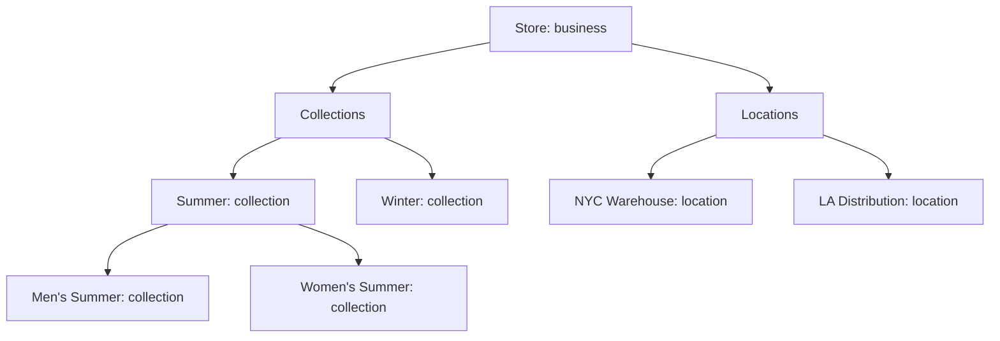
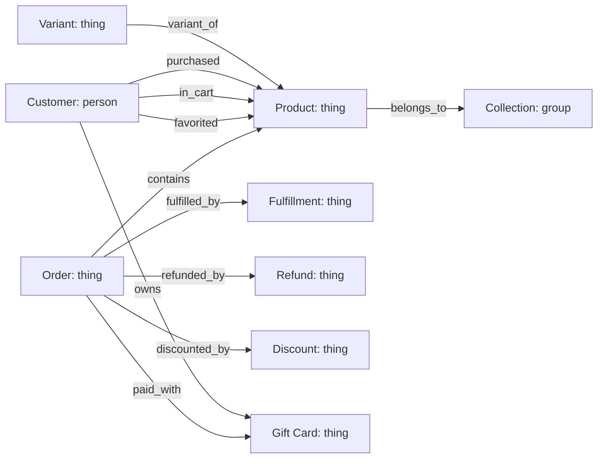
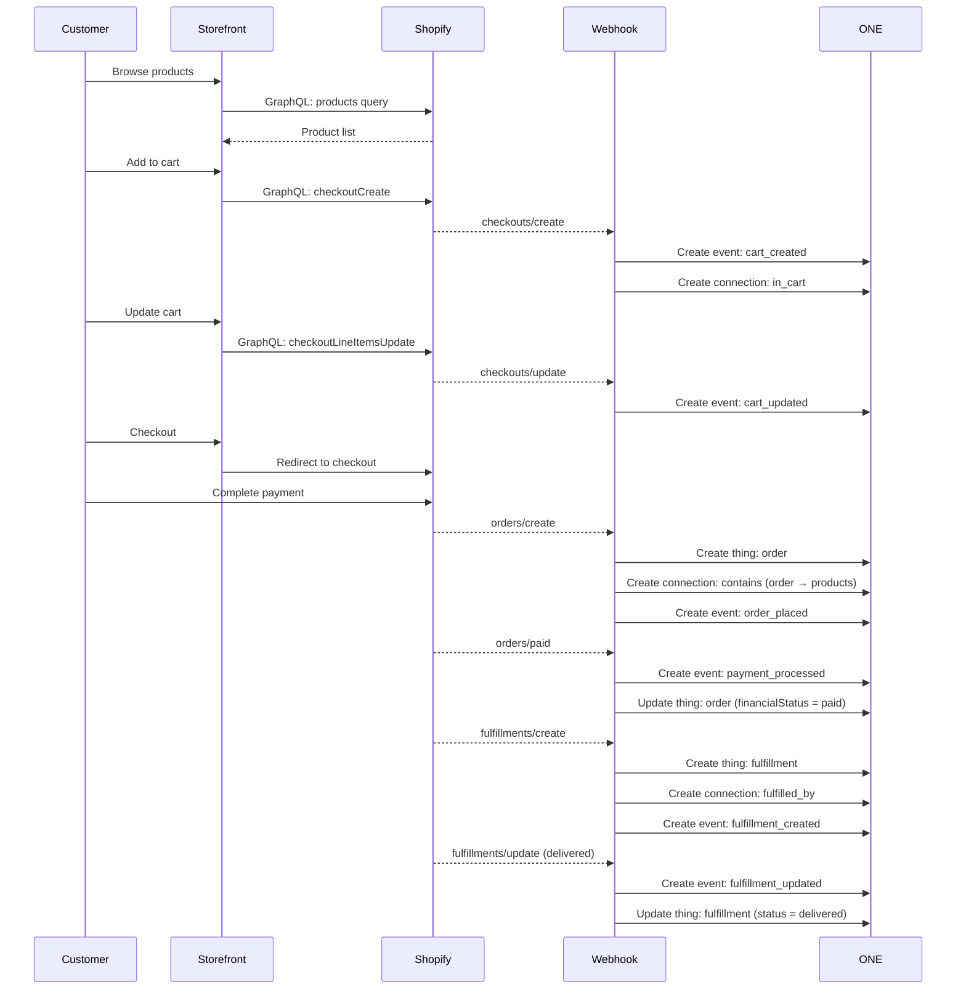
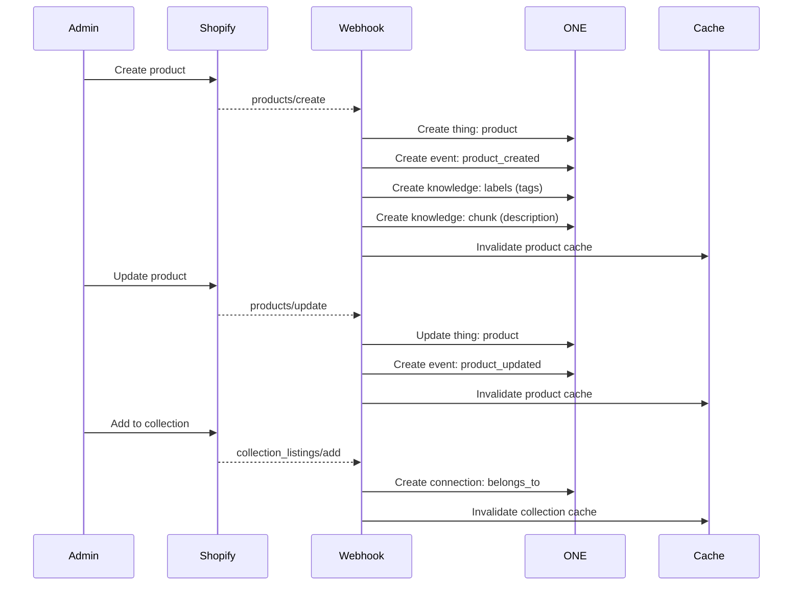
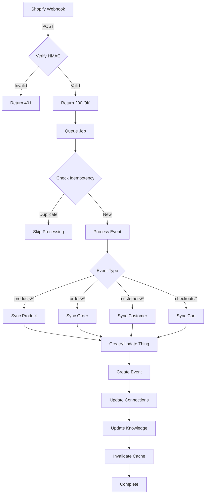

# Shopify Complete Ontology Mapping

**Version:** 1.0.0
**Purpose:** Comprehensive mapping of Shopify e-commerce platform to ONE's 6-dimension ontology
**Status:** Complete - Phase 1 Research (Cycle 14)

---

## Executive Summary

This document provides the complete mapping of **all** Shopify entities to the ONE Platform's 6-dimension ontology (groups, people, things, connections, events, knowledge). This mapping enables:

- **Zero custom tables:** Everything fits into 5 universal tables
- **Universal patterns:** All operations use the same DataProvider interface
- **Backend agnostic:** Frontend never knows it's Shopify
- **Gradual migration:** Hybrid Shopify + Convex mode supported

**Key Insight:** Shopify's complex e-commerce model maps perfectly to the 6 dimensions because the ontology models reality itself, not any specific technology.

---

## Table of Contents

1. [Dimension 1: Groups (Containers)](#dimension-1-groups-containers)
2. [Dimension 2: People (Authorization)](#dimension-2-people-authorization)
3. [Dimension 3: Things (Entities)](#dimension-3-things-entities)
4. [Dimension 4: Connections (Relationships)](#dimension-4-connections-relationships)
5. [Dimension 5: Events (Actions)](#dimension-5-events-actions)
6. [Dimension 6: Knowledge (Understanding)](#dimension-6-knowledge-understanding)
7. [Complete Entity Reference](#complete-entity-reference)
8. [Event Flow Diagrams](#event-flow-diagrams)
9. [Implementation Patterns](#implementation-patterns)

---

## Dimension 1: Groups (Containers)

**Purpose:** Multi-tenant isolation and hierarchical organization

### Shopify → Groups Mapping

```typescript
interface ShopifyGroupMapping {
  // Root store
  "Shopify Store" → groups {
    type: "business",
    name: "My Store",
    properties: {
      shopDomain: "mystore.myshopify.com",
      shopId: "gid://shopify/Shop/123",
      currency: "USD",
      timezone: "America/New_York",
      plan: "shopify_plus"
    }
  }

  // Product collections (hierarchical)
  "Collection" → groups {
    type: "collection",
    parentGroupId: storeGroupId,
    name: "Summer Collection",
    properties: {
      collectionId: "gid://shopify/Collection/456",
      handle: "summer-2025",
      sortOrder: "best-selling",
      isSmartCollection: false,
      rules: [] // For smart collections
    }
  }

  // Nested collections
  "Collection > Subcollection" → groups {
    type: "collection",
    parentGroupId: parentCollectionGroupId,
    name: "Men's Summer Shirts",
    properties: { ... }
  }

  // Inventory locations
  "Location" → groups {
    type: "location",
    parentGroupId: storeGroupId,
    name: "NYC Warehouse",
    properties: {
      locationId: "gid://shopify/Location/789",
      address: { ... },
      active: true
    }
  }
}
```

### Hierarchical Structure

```
Store (Root Group)
├── Collections (Product Groups)
│   ├── Summer Collection
│   │   ├── Men's Summer
│   │   └── Women's Summer
│   ├── Winter Collection
│   └── Sale Items
├── Locations (Inventory Groups)
│   ├── NYC Warehouse
│   ├── LA Distribution Center
│   └── Store #1 (Retail)
└── Markets (Geographic Groups)
    ├── North America
    ├── Europe
    └── Asia Pacific
```

### Mermaid Diagram



---

## Dimension 2: People (Authorization)

**Purpose:** Authorization, roles, and governance

### Shopify → People Mapping

```typescript
interface ShopifyPeopleMapping {
  // Store owner
  "Shop Owner" → people {
    role: "org_owner",
    groupId: storeGroupId,
    userId: "auth_user_123",
    properties: {
      shopifyStaffId: "gid://shopify/StaffMember/1",
      permissions: ["manage_products", "manage_orders", "manage_settings"]
    }
  }

  // Staff members
  "Staff Member" → people {
    role: "org_user",
    groupId: storeGroupId,
    userId: "auth_user_456",
    properties: {
      shopifyStaffId: "gid://shopify/StaffMember/2",
      permissions: ["manage_products", "manage_orders"]
    }
  }

  // Customers
  "Customer" → people {
    role: "customer",
    groupId: storeGroupId,
    userId: "auth_user_789",
    properties: {
      shopifyCustomerId: "gid://shopify/Customer/999",
      email: "customer@example.com",
      firstName: "John",
      lastName: "Doe",
      phone: "+1234567890",
      acceptsMarketing: true,
      tags: ["vip", "wholesale"],
      totalSpent: "1234.56",
      ordersCount: 12,
      addresses: [
        {
          address1: "123 Main St",
          city: "New York",
          province: "NY",
          country: "US",
          zip: "10001",
          default: true
        }
      ]
    }
  }
}
```

### Role Mapping

| Shopify Role | ONE Role | Permissions |
|--------------|----------|-------------|
| Shop Owner | `org_owner` | Full access to store |
| Staff Member | `org_user` | Limited access based on permissions |
| Customer | `customer` | Own orders, account, wishlist |
| Anonymous | N/A | Browse products, add to cart |

---

## Dimension 3: Things (Entities)

**Purpose:** All entities in the system (66+ types)

### Shopify → Things Mapping

```typescript
interface ShopifyThingsMapping {
  // Products
  "Product" → things {
    type: "product",
    groupId: storeGroupId,
    name: "Awesome T-Shirt",
    description: "The most comfortable shirt you'll ever wear",
    properties: {
      shopifyProductId: "gid://shopify/Product/123",
      handle: "awesome-t-shirt",
      productType: "Apparel",
      vendor: "My Brand",
      tags: ["cotton", "summer", "bestseller"],
      status: "active",
      publishedAt: "2025-01-01T00:00:00Z",
      templateSuffix: null,
      seo: {
        title: "Awesome T-Shirt | My Store",
        description: "Buy the best t-shirt..."
      },
      // Inventory managed via variants
      options: [
        { name: "Size", values: ["S", "M", "L", "XL"] },
        { name: "Color", values: ["Red", "Blue", "Green"] }
      ],
      images: [
        {
          src: "https://cdn.shopify.com/...",
          altText: "Red t-shirt front",
          position: 1
        }
      ]
    }
  }

  // Product variants
  "Variant" → things {
    type: "product_variant",
    groupId: storeGroupId,
    name: "Awesome T-Shirt - Red / Large",
    properties: {
      shopifyVariantId: "gid://shopify/ProductVariant/456",
      sku: "TS-RED-L",
      barcode: "1234567890123",
      price: "29.99",
      compareAtPrice: "39.99",
      position: 1,
      inventoryPolicy: "deny", // or "continue"
      fulfillmentService: "manual",
      inventoryManagement: "shopify",
      inventoryQuantity: 100,
      weight: 0.5,
      weightUnit: "lb",
      requiresShipping: true,
      taxable: true,
      option1: "Red",   // Color
      option2: "L",     // Size
      option3: null,
      image: {
        src: "https://cdn.shopify.com/...",
        altText: "Red t-shirt"
      }
    }
  }

  // Orders (as things, not connections)
  "Order" → things {
    type: "order",
    groupId: storeGroupId,
    name: "Order #1001",
    properties: {
      shopifyOrderId: "gid://shopify/Order/789",
      orderNumber: 1001,
      email: "customer@example.com",
      financialStatus: "paid",      // pending, paid, refunded
      fulfillmentStatus: "fulfilled", // fulfilled, partial, unfulfilled
      currency: "USD",
      subtotalPrice: "59.98",
      totalTax: "5.40",
      totalShipping: "10.00",
      totalPrice: "75.38",
      totalDiscounts: "5.00",
      processedAt: "2025-01-15T10:30:00Z",
      cancelledAt: null,
      closedAt: "2025-01-17T14:00:00Z",
      shippingAddress: { ... },
      billingAddress: { ... },
      shippingLines: [
        {
          title: "Standard Shipping",
          price: "10.00",
          code: "STANDARD"
        }
      ],
      taxLines: [
        {
          title: "State Tax",
          price: "5.40",
          rate: 0.09
        }
      ],
      discountCodes: [
        {
          code: "SUMMER10",
          amount: "5.00",
          type: "percentage"
        }
      ],
      note: "Please gift wrap",
      tags: ["wholesale", "priority"]
    }
  }

  // Discounts
  "Discount Code" → things {
    type: "discount",
    groupId: storeGroupId,
    name: "SUMMER10",
    properties: {
      shopifyDiscountId: "gid://shopify/DiscountCode/111",
      code: "SUMMER10",
      valueType: "percentage",      // percentage, fixed_amount
      value: "10.0",
      startsAt: "2025-06-01T00:00:00Z",
      endsAt: "2025-08-31T23:59:59Z",
      usageLimit: 1000,
      usageCount: 247,
      oncePerCustomer: true,
      minimumSubtotalAmount: "50.00",
      appliesTo: "all_products",    // all_products, specific_collections, specific_products
      targetSelection: [],
      targetType: "line_item"
    }
  }

  // Gift cards
  "Gift Card" → things {
    type: "gift_card",
    groupId: storeGroupId,
    name: "Gift Card - $50",
    properties: {
      shopifyGiftCardId: "gid://shopify/GiftCard/222",
      code: "GIFT-1234-5678-9012",
      initialValue: "50.00",
      balance: "27.50",
      currency: "USD",
      expiresOn: null,
      disabled: false,
      createdAt: "2025-01-10T00:00:00Z"
    }
  }

  // Fulfillments
  "Fulfillment" → things {
    type: "fulfillment",
    groupId: storeGroupId,
    name: "Fulfillment for Order #1001",
    properties: {
      shopifyFulfillmentId: "gid://shopify/Fulfillment/333",
      status: "success",             // pending, success, cancelled, error
      trackingCompany: "USPS",
      trackingNumbers: ["9400111899563824166000"],
      trackingUrls: ["https://tools.usps.com/..."],
      shipmentStatus: "delivered",   // in_transit, delivered, out_for_delivery
      createdAt: "2025-01-16T08:00:00Z",
      updatedAt: "2025-01-18T14:30:00Z"
    }
  }

  // Draft orders
  "Draft Order" → things {
    type: "draft_order",
    groupId: storeGroupId,
    name: "Draft Order #D1",
    properties: {
      shopifyDraftOrderId: "gid://shopify/DraftOrder/444",
      status: "open",               // open, invoice_sent, completed
      invoiceUrl: "https://checkout.shopify.com/...",
      invoiceSentAt: null,
      completedAt: null,
      // Same structure as Order
      ...orderProperties
    }
  }

  // Checkouts (abandoned carts)
  "Checkout" → things {
    type: "checkout",
    groupId: storeGroupId,
    name: "Checkout Token ABC123",
    properties: {
      shopifyCheckoutId: "gid://shopify/Checkout/555",
      token: "abc123def456",
      cartToken: "cart123",
      email: "customer@example.com",
      completedAt: null,
      abandonedCheckoutUrl: "https://mystore.com/cart/abc123",
      totalPrice: "89.99",
      currency: "USD",
      createdAt: "2025-01-20T15:45:00Z",
      updatedAt: "2025-01-20T15:47:00Z"
    }
  }

  // Refunds
  "Refund" → things {
    type: "refund",
    groupId: storeGroupId,
    name: "Refund for Order #1001",
    properties: {
      shopifyRefundId: "gid://shopify/Refund/666",
      note: "Customer requested size exchange",
      createdAt: "2025-01-21T10:00:00Z",
      processedAt: "2025-01-21T10:05:00Z",
      refundLineItems: [
        {
          lineItemId: "gid://shopify/LineItem/111",
          quantity: 1,
          restockType: "return",     // no_restock, cancel, return
          subtotal: "29.99",
          totalTax: "2.70"
        }
      ],
      transactions: [
        {
          kind: "refund",
          status: "success",
          amount: "32.69"
        }
      ]
    }
  }
}
```

### Thing Types Summary

| Shopify Entity | ONE Thing Type | Description |
|----------------|----------------|-------------|
| Product | `product` | Main product entity |
| Variant | `product_variant` | Product variations (size, color) |
| Order | `order` | Customer orders |
| Draft Order | `draft_order` | Unpaid/incomplete orders |
| Checkout | `checkout` | Abandoned carts |
| Discount Code | `discount` | Promotional codes |
| Gift Card | `gift_card` | Store credit cards |
| Fulfillment | `fulfillment` | Shipping/delivery records |
| Refund | `refund` | Return/refund records |

---

## Dimension 4: Connections (Relationships)

**Purpose:** All relationships between entities

### Shopify → Connections Mapping

```typescript
interface ShopifyConnectionsMapping {
  // Product belongs to collection
  "Product ↔ Collection" → connections {
    type: "belongs_to",
    fromThingId: productThingId,
    toThingId: collectionGroupId,
    metadata: {
      position: 5,  // Product position in collection
      featured: true
    }
  }

  // Customer purchased product (via order)
  "Customer ↔ Product" → connections {
    type: "purchased",
    fromThingId: customerPersonId,
    toThingId: productThingId,
    metadata: {
      orderId: orderThingId,
      quantity: 2,
      price: "29.99",
      variantId: variantThingId,
      purchasedAt: "2025-01-15T10:30:00Z"
    }
  }

  // Order contains product (line items)
  "Order ↔ Product" → connections {
    type: "contains",
    fromThingId: orderThingId,
    toThingId: productThingId,
    metadata: {
      lineItemId: "gid://shopify/LineItem/123",
      variantId: variantThingId,
      quantity: 2,
      price: "29.99",
      totalDiscount: "3.00",
      giftCard: false,
      fulfillableQuantity: 2,
      fulfillmentStatus: "fulfilled",
      properties: [
        { name: "Engraving", value: "Happy Birthday!" }
      ]
    }
  }

  // Order fulfilled by fulfillment
  "Order ↔ Fulfillment" → connections {
    type: "fulfilled_by",
    fromThingId: orderThingId,
    toThingId: fulfillmentThingId,
    metadata: {
      lineItems: [
        { lineItemId: "...", quantity: 2 }
      ]
    }
  }

  // Order refunded by refund
  "Order ↔ Refund" → connections {
    type: "refunded_by",
    fromThingId: orderThingId,
    toThingId: refundThingId,
    metadata: {
      refundAmount: "32.69",
      refundReason: "customer_request"
    }
  }

  // Customer in cart (active cart)
  "Customer ↔ Product" → connections {
    type: "in_cart",
    fromThingId: customerPersonId,
    toThingId: productThingId,
    metadata: {
      cartToken: "cart123",
      variantId: variantThingId,
      quantity: 1,
      addedAt: "2025-01-20T15:45:00Z",
      properties: []
    }
  }

  // Customer favorited product (wishlist)
  "Customer ↔ Product" → connections {
    type: "favorited",
    fromThingId: customerPersonId,
    toThingId: productThingId,
    metadata: {
      favoritedAt: "2025-01-18T09:00:00Z"
    }
  }

  // Product variant of product
  "Variant ↔ Product" → connections {
    type: "variant_of",
    fromThingId: variantThingId,
    toThingId: productThingId,
    metadata: {
      position: 1
    }
  }

  // Discount applied to order
  "Order ↔ Discount" → connections {
    type: "discounted_by",
    fromThingId: orderThingId,
    toThingId: discountThingId,
    metadata: {
      discountAmount: "5.00",
      discountCode: "SUMMER10"
    }
  }

  // Customer owns gift card
  "Customer ↔ Gift Card" → connections {
    type: "owns",
    fromThingId: customerPersonId,
    toThingId: giftCardThingId,
    metadata: {
      purchasedAt: "2025-01-10T00:00:00Z"
    }
  }

  // Gift card used in order
  "Order ↔ Gift Card" → connections {
    type: "paid_with",
    fromThingId: orderThingId,
    toThingId: giftCardThingId,
    metadata: {
      amountUsed: "22.50"
    }
  }
}
```

### Connection Types Summary

| Connection Type | From → To | Description |
|-----------------|-----------|-------------|
| `belongs_to` | Product → Collection | Product in collection |
| `purchased` | Customer → Product | Customer bought product |
| `contains` | Order → Product | Order line items |
| `fulfilled_by` | Order → Fulfillment | Order shipped |
| `refunded_by` | Order → Refund | Order refunded |
| `in_cart` | Customer → Product | Product in cart |
| `favorited` | Customer → Product | Wishlist item |
| `variant_of` | Variant → Product | Variant relationship |
| `discounted_by` | Order → Discount | Discount applied |
| `owns` | Customer → Gift Card | Gift card ownership |
| `paid_with` | Order → Gift Card | Payment method |

### Relationship Diagram



---

## Dimension 5: Events (Actions)

**Purpose:** Complete audit trail of all actions

### Shopify → Events Mapping

```typescript
interface ShopifyEventsMapping {
  // Product events
  "products/create" → events {
    type: "product_created",
    thingId: productThingId,
    actorId: staffPersonId,
    groupId: storeGroupId,
    metadata: {
      shopifyWebhookId: "webhook-123",
      shopifyProductId: "gid://shopify/Product/123",
      productTitle: "Awesome T-Shirt",
      productType: "Apparel",
      vendor: "My Brand"
    }
  }

  "products/update" → events {
    type: "product_updated",
    thingId: productThingId,
    actorId: staffPersonId,
    groupId: storeGroupId,
    metadata: {
      shopifyWebhookId: "webhook-124",
      changes: {
        title: { old: "T-Shirt", new: "Awesome T-Shirt" },
        price: { old: "24.99", new: "29.99" }
      }
    }
  }

  "products/delete" → events {
    type: "product_deleted",
    thingId: productThingId,
    actorId: staffPersonId,
    groupId: storeGroupId,
    metadata: {
      shopifyWebhookId: "webhook-125",
      productTitle: "Awesome T-Shirt"
    }
  }

  // Order events
  "orders/create" → events {
    type: "order_placed",
    thingId: orderThingId,
    actorId: customerPersonId,
    groupId: storeGroupId,
    metadata: {
      shopifyWebhookId: "webhook-200",
      orderNumber: 1001,
      totalPrice: "75.38",
      currency: "USD",
      itemCount: 2
    }
  }

  "orders/updated" → events {
    type: "order_updated",
    thingId: orderThingId,
    actorId: staffPersonId,
    groupId: storeGroupId,
    metadata: {
      shopifyWebhookId: "webhook-201",
      changes: {
        financialStatus: { old: "pending", new: "paid" }
      }
    }
  }

  "orders/paid" → events {
    type: "payment_processed",
    thingId: orderThingId,
    actorId: null,  // System event
    groupId: storeGroupId,
    metadata: {
      shopifyWebhookId: "webhook-202",
      amount: "75.38",
      currency: "USD",
      paymentMethod: "credit_card",
      gateway: "shopify_payments"
    }
  }

  "orders/cancelled" → events {
    type: "order_cancelled",
    thingId: orderThingId,
    actorId: staffPersonId,
    groupId: storeGroupId,
    metadata: {
      shopifyWebhookId: "webhook-203",
      reason: "customer_request",
      cancelledBy: "staff"
    }
  }

  "orders/fulfilled" → events {
    type: "order_fulfilled",
    thingId: orderThingId,
    actorId: staffPersonId,
    groupId: storeGroupId,
    metadata: {
      shopifyWebhookId: "webhook-204",
      fulfillmentId: fulfillmentThingId,
      trackingNumber: "9400111899563824166000",
      trackingCompany: "USPS"
    }
  }

  // Fulfillment events
  "fulfillments/create" → events {
    type: "fulfillment_created",
    thingId: fulfillmentThingId,
    actorId: staffPersonId,
    groupId: storeGroupId,
    metadata: {
      shopifyWebhookId: "webhook-300",
      orderId: orderThingId,
      trackingNumber: "9400111899563824166000"
    }
  }

  "fulfillments/update" → events {
    type: "fulfillment_updated",
    thingId: fulfillmentThingId,
    actorId: null,  // Carrier webhook
    groupId: storeGroupId,
    metadata: {
      shopifyWebhookId: "webhook-301",
      shipmentStatus: "delivered",
      deliveredAt: "2025-01-18T14:30:00Z"
    }
  }

  // Customer events
  "customers/create" → events {
    type: "customer_registered",
    thingId: null,
    actorId: customerPersonId,
    groupId: storeGroupId,
    metadata: {
      shopifyWebhookId: "webhook-400",
      email: "customer@example.com",
      source: "storefront"
    }
  }

  "customers/update" → events {
    type: "customer_updated",
    thingId: null,
    actorId: customerPersonId,
    groupId: storeGroupId,
    metadata: {
      shopifyWebhookId: "webhook-401",
      changes: {
        acceptsMarketing: { old: false, new: true }
      }
    }
  }

  // Cart events
  "checkouts/create" → events {
    type: "cart_created",
    thingId: checkoutThingId,
    actorId: customerPersonId,
    groupId: storeGroupId,
    metadata: {
      shopifyWebhookId: "webhook-500",
      cartToken: "cart123",
      itemCount: 1
    }
  }

  "checkouts/update" → events {
    type: "cart_updated",
    thingId: checkoutThingId,
    actorId: customerPersonId,
    groupId: storeGroupId,
    metadata: {
      shopifyWebhookId: "webhook-501",
      addedItems: [{ productId: "...", quantity: 1 }],
      removedItems: []
    }
  }

  // Abandoned cart
  "checkouts/create" + 1 hour → events {
    type: "cart_abandoned",
    thingId: checkoutThingId,
    actorId: customerPersonId,
    groupId: storeGroupId,
    metadata: {
      abandonedAt: "2025-01-20T16:47:00Z",
      cartValue: "89.99",
      itemCount: 2,
      email: "customer@example.com",
      recoveryUrl: "https://mystore.com/cart/abc123"
    }
  }

  // Product view (client-side tracking)
  "product_page_view" → events {
    type: "product_viewed",
    thingId: productThingId,
    actorId: customerPersonId,
    groupId: storeGroupId,
    metadata: {
      referrer: "https://google.com",
      userAgent: "Mozilla/5.0...",
      duration: 45  // seconds
    }
  }

  // Refund events
  "refunds/create" → events {
    type: "order_refunded",
    thingId: refundThingId,
    actorId: staffPersonId,
    groupId: storeGroupId,
    metadata: {
      shopifyWebhookId: "webhook-600",
      orderId: orderThingId,
      refundAmount: "32.69",
      reason: "customer_request"
    }
  }

  // Inventory events
  "inventory_levels/update" → events {
    type: "inventory_adjusted",
    thingId: variantThingId,
    actorId: staffPersonId,
    groupId: storeGroupId,
    metadata: {
      shopifyWebhookId: "webhook-700",
      locationId: locationGroupId,
      oldQuantity: 100,
      newQuantity: 98,
      reason: "sold"
    }
  }

  // Collection events
  "collections/create" → events {
    type: "collection_created",
    thingId: null,
    actorId: staffPersonId,
    groupId: collectionGroupId,
    metadata: {
      shopifyWebhookId: "webhook-800",
      collectionTitle: "Summer Collection"
    }
  }
}
```

### Event Types Summary

| Shopify Webhook | ONE Event Type | Description |
|-----------------|----------------|-------------|
| `products/create` | `product_created` | New product added |
| `products/update` | `product_updated` | Product modified |
| `products/delete` | `product_deleted` | Product removed |
| `orders/create` | `order_placed` | New order created |
| `orders/updated` | `order_updated` | Order modified |
| `orders/paid` | `payment_processed` | Payment received |
| `orders/cancelled` | `order_cancelled` | Order cancelled |
| `orders/fulfilled` | `order_fulfilled` | Order shipped |
| `fulfillments/create` | `fulfillment_created` | Shipment created |
| `fulfillments/update` | `fulfillment_updated` | Tracking updated |
| `customers/create` | `customer_registered` | New customer |
| `customers/update` | `customer_updated` | Customer modified |
| `checkouts/create` | `cart_created` | Cart started |
| `checkouts/update` | `cart_updated` | Cart modified |
| (derived) | `cart_abandoned` | Cart not completed |
| (client-side) | `product_viewed` | Product page view |
| `refunds/create` | `order_refunded` | Refund issued |
| `inventory_levels/update` | `inventory_adjusted` | Stock changed |
| `collections/create` | `collection_created` | Collection added |

---

## Dimension 6: Knowledge (Understanding)

**Purpose:** Labels, vectors, embeddings for RAG and search

### Shopify → Knowledge Mapping

```typescript
interface ShopifyKnowledgeMapping {
  // Product tags as labels
  "Product Tags" → knowledge {
    type: "label",
    thingId: productThingId,
    labels: ["cotton", "summer", "bestseller", "eco-friendly"],
    metadata: {
      source: "shopify_tags"
    }
  }

  // Product SEO as labels
  "Product SEO" → knowledge {
    type: "label",
    thingId: productThingId,
    labels: ["seo", "product"],
    metadata: {
      seoTitle: "Awesome T-Shirt | My Store",
      seoDescription: "Buy the best t-shirt...",
      metaKeywords: ["t-shirt", "cotton", "comfortable"]
    }
  }

  // Product description for RAG
  "Product Description" → knowledge {
    type: "chunk",
    thingId: productThingId,
    content: "The most comfortable shirt you'll ever wear. Made from 100% organic cotton...",
    embedding: [0.123, 0.456, ...],  // Vector from OpenAI
    metadata: {
      chunkType: "product_description",
      language: "en"
    }
  }

  // Product reviews for RAG
  "Product Reviews" → knowledge {
    type: "chunk",
    thingId: productThingId,
    content: "Customer review: This shirt is amazing! So soft and fits perfectly.",
    embedding: [0.789, 0.012, ...],
    metadata: {
      chunkType: "product_review",
      rating: 5,
      reviewerId: customerPersonId,
      verified: true
    }
  }

  // Customer preferences (for AI personalization)
  "Customer Preferences" → knowledge {
    type: "chunk",
    thingId: null,
    actorId: customerPersonId,
    content: "Customer frequently purchases: organic cotton apparel, size L, prefers blue/green colors, price range $25-50",
    embedding: [0.345, 0.678, ...],
    metadata: {
      chunkType: "customer_profile",
      generatedFrom: "purchase_history"
    }
  }

  // Product search terms
  "Search Keywords" → knowledge {
    type: "label",
    thingId: productThingId,
    labels: ["t-shirt", "tshirt", "tee", "shirt", "top"],
    metadata: {
      labelType: "search_keyword",
      language: "en"
    }
  }

  // Collection description for RAG
  "Collection Description" → knowledge {
    type: "chunk",
    thingId: null,
    groupId: collectionGroupId,
    content: "Summer Collection 2025: Light, breathable fabrics perfect for warm weather...",
    embedding: [0.234, 0.567, ...],
    metadata: {
      chunkType: "collection_description"
    }
  }
}
```

### Knowledge Use Cases

1. **Semantic Product Search**
   - User searches "soft summer clothes"
   - Vectorize query → Find nearest embeddings
   - Return products with similar descriptions/reviews

2. **AI Product Recommendations**
   - Load customer preference embedding
   - Find similar products by vector similarity
   - Personalized recommendations

3. **AI Customer Support**
   - Customer asks "Do you have large blue shirts?"
   - RAG search across product descriptions
   - AI agent answers with specific products

4. **Content Generation**
   - Use product descriptions as training data
   - Generate SEO content, social media posts
   - Maintain brand voice consistency

---

## Complete Entity Reference

### All Shopify Entities → ONE Dimensions

```typescript
const COMPLETE_MAPPING = {
  // GROUPS
  groups: [
    "Shop → business",
    "Collection → collection",
    "Location → location",
    "Market → market"
  ],

  // PEOPLE
  people: [
    "Shop Owner → org_owner",
    "Staff Member → org_user",
    "Customer → customer"
  ],

  // THINGS
  things: [
    "Product → product",
    "Variant → product_variant",
    "Order → order",
    "Draft Order → draft_order",
    "Checkout → checkout",
    "Discount Code → discount",
    "Gift Card → gift_card",
    "Fulfillment → fulfillment",
    "Refund → refund"
  ],

  // CONNECTIONS
  connections: [
    "Product → Collection: belongs_to",
    "Variant → Product: variant_of",
    "Customer → Product: purchased",
    "Customer → Product: in_cart",
    "Customer → Product: favorited",
    "Order → Product: contains",
    "Order → Fulfillment: fulfilled_by",
    "Order → Refund: refunded_by",
    "Order → Discount: discounted_by",
    "Order → Gift Card: paid_with",
    "Customer → Gift Card: owns"
  ],

  // EVENTS
  events: [
    "products/create → product_created",
    "products/update → product_updated",
    "products/delete → product_deleted",
    "orders/create → order_placed",
    "orders/updated → order_updated",
    "orders/paid → payment_processed",
    "orders/cancelled → order_cancelled",
    "orders/fulfilled → order_fulfilled",
    "fulfillments/create → fulfillment_created",
    "fulfillments/update → fulfillment_updated",
    "customers/create → customer_registered",
    "customers/update → customer_updated",
    "checkouts/create → cart_created",
    "checkouts/update → cart_updated",
    "(derived) → cart_abandoned",
    "(client) → product_viewed",
    "refunds/create → order_refunded",
    "inventory_levels/update → inventory_adjusted",
    "collections/create → collection_created"
  ],

  // KNOWLEDGE
  knowledge: [
    "Product Tags → labels",
    "Product SEO → labels",
    "Product Description → chunk (RAG)",
    "Product Reviews → chunk (RAG)",
    "Customer Preferences → chunk (AI)",
    "Search Keywords → labels",
    "Collection Description → chunk (RAG)"
  ]
};
```

---

## Event Flow Diagrams

### Order Placement Flow



### Product Sync Flow



### Webhook → Event Processing Flow



---

## Implementation Patterns

### Pattern 1: Thing Creation from Shopify API

```typescript
// Transform Shopify Product → ONE Thing
async function syncProduct(shopifyProduct: ShopifyProduct) {
  const thing = await provider.things.create({
    type: "product",
    groupId: storeGroupId,
    name: shopifyProduct.title,
    description: shopifyProduct.body_html,
    properties: {
      shopifyProductId: shopifyProduct.id,
      handle: shopifyProduct.handle,
      productType: shopifyProduct.product_type,
      vendor: shopifyProduct.vendor,
      tags: shopifyProduct.tags,
      status: shopifyProduct.status,
      publishedAt: shopifyProduct.published_at,
      options: shopifyProduct.options,
      images: shopifyProduct.images
    }
  });

  // Create variants as separate things
  for (const variant of shopifyProduct.variants) {
    const variantThing = await provider.things.create({
      type: "product_variant",
      groupId: storeGroupId,
      name: `${shopifyProduct.title} - ${variant.title}`,
      properties: {
        shopifyVariantId: variant.id,
        sku: variant.sku,
        price: variant.price,
        inventoryQuantity: variant.inventory_quantity,
        // ...all variant fields
      }
    });

    // Create connection: variant → product
    await provider.connections.create({
      type: "variant_of",
      fromThingId: variantThing.id,
      toThingId: thing.id,
      metadata: { position: variant.position }
    });
  }

  // Create knowledge labels (tags)
  await provider.knowledge.create({
    type: "label",
    thingId: thing.id,
    labels: shopifyProduct.tags,
    metadata: { source: "shopify_tags" }
  });

  // Create knowledge chunk (description for RAG)
  const embedding = await generateEmbedding(shopifyProduct.body_html);
  await provider.knowledge.create({
    type: "chunk",
    thingId: thing.id,
    content: shopifyProduct.body_html,
    embedding,
    metadata: { chunkType: "product_description" }
  });

  return thing;
}
```

### Pattern 2: Order Processing from Webhook

```typescript
async function handleOrderCreated(webhookPayload: ShopifyOrder) {
  // 1. Create order thing
  const orderThing = await provider.things.create({
    type: "order",
    groupId: storeGroupId,
    name: `Order #${webhookPayload.order_number}`,
    properties: {
      shopifyOrderId: webhookPayload.id,
      orderNumber: webhookPayload.order_number,
      email: webhookPayload.email,
      financialStatus: webhookPayload.financial_status,
      fulfillmentStatus: webhookPayload.fulfillment_status,
      totalPrice: webhookPayload.total_price,
      // ...all order fields
    }
  });

  // 2. Create connections for line items
  for (const lineItem of webhookPayload.line_items) {
    const productThing = await findThingByShopifyId(lineItem.product_id);

    await provider.connections.create({
      type: "contains",
      fromThingId: orderThing.id,
      toThingId: productThing.id,
      metadata: {
        lineItemId: lineItem.id,
        quantity: lineItem.quantity,
        price: lineItem.price,
        variantId: lineItem.variant_id
      }
    });

    // Also create "purchased" connection from customer
    const customer = await findPersonByShopifyId(webhookPayload.customer.id);
    await provider.connections.create({
      type: "purchased",
      fromThingId: customer.id,
      toThingId: productThing.id,
      metadata: {
        orderId: orderThing.id,
        quantity: lineItem.quantity,
        price: lineItem.price,
        purchasedAt: webhookPayload.processed_at
      }
    });
  }

  // 3. Create event
  await provider.events.create({
    type: "order_placed",
    thingId: orderThing.id,
    actorId: customer.id,
    groupId: storeGroupId,
    metadata: {
      shopifyWebhookId: webhookPayload.id,
      orderNumber: webhookPayload.order_number,
      totalPrice: webhookPayload.total_price,
      itemCount: webhookPayload.line_items.length
    }
  });

  // 4. Delete cart connections (cart → checkout conversion)
  const cartConnections = await provider.connections.list({
    type: "in_cart",
    fromThingId: customer.id
  });
  for (const conn of cartConnections) {
    await provider.connections.delete(conn.id);
  }

  return orderThing;
}
```

### Pattern 3: Cart Management

```typescript
async function addToCart(customerId: string, productId: string, variantId: string, quantity: number) {
  const productThing = await provider.things.get(productId);
  const customer = await provider.people.get(customerId);

  // Check if already in cart
  const existing = await provider.connections.findOne({
    type: "in_cart",
    fromThingId: customerId,
    toThingId: productId,
    "metadata.variantId": variantId
  });

  if (existing) {
    // Update quantity
    await provider.connections.update(existing.id, {
      metadata: {
        ...existing.metadata,
        quantity: existing.metadata.quantity + quantity
      }
    });
  } else {
    // Create new cart connection
    await provider.connections.create({
      type: "in_cart",
      fromThingId: customerId,
      toThingId: productId,
      metadata: {
        variantId,
        quantity,
        addedAt: new Date().toISOString()
      }
    });
  }

  // Create event
  await provider.events.create({
    type: "product_added_to_cart",
    thingId: productId,
    actorId: customerId,
    groupId: storeGroupId,
    metadata: { variantId, quantity }
  });
}

async function getCart(customerId: string) {
  const connections = await provider.connections.list({
    type: "in_cart",
    fromThingId: customerId
  });

  const cartItems = await Promise.all(
    connections.map(async (conn) => {
      const product = await provider.things.get(conn.toThingId);
      const variant = await provider.things.get(conn.metadata.variantId);

      return {
        product,
        variant,
        quantity: conn.metadata.quantity,
        addedAt: conn.metadata.addedAt
      };
    })
  );

  return cartItems;
}
```

---

## Summary

This complete mapping demonstrates that **every** Shopify entity fits perfectly into the 6-dimension ontology:

- **Groups:** Stores, Collections, Locations (containers)
- **People:** Owners, Staff, Customers (authorization)
- **Things:** Products, Variants, Orders, Discounts, etc. (entities)
- **Connections:** belongs_to, purchased, contains, etc. (relationships)
- **Events:** product_created, order_placed, cart_abandoned, etc. (actions)
- **Knowledge:** Tags, descriptions, reviews (understanding)

**Key Benefits:**
1. **Zero custom tables** - Everything fits into 5 universal tables
2. **Universal patterns** - Same interface for all operations
3. **Backend agnostic** - Can swap Shopify for Convex seamlessly
4. **AI-ready** - Perfect structure for RAG, embeddings, personalization
5. **Audit trail** - Complete event history
6. **Real-time sync** - Webhooks keep data in sync

**Next Steps:**
- Define MVP scope (Cycle 15)
- Design TypeScript types (Cycles 16-25)
- Implement ShopifyProvider (Cycles 26-65)

---

**Built with clarity, simplicity, and infinite scale in mind.**
