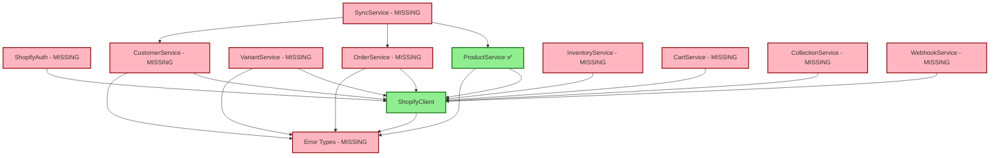
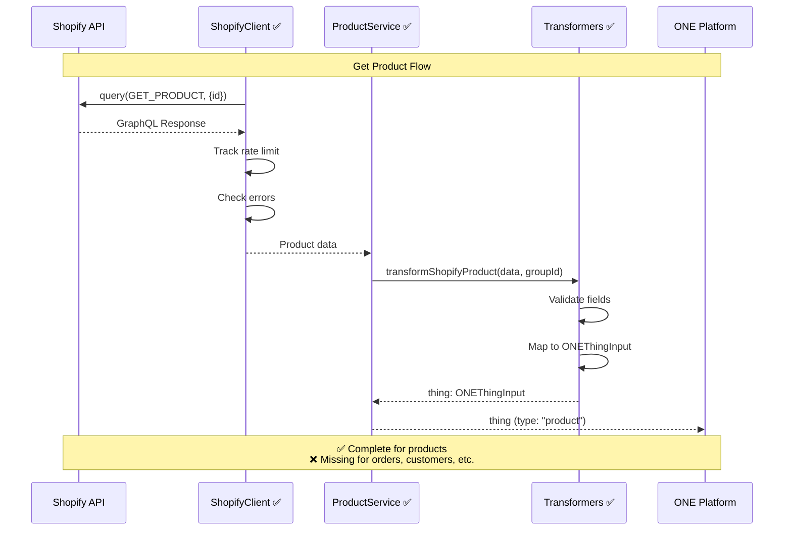
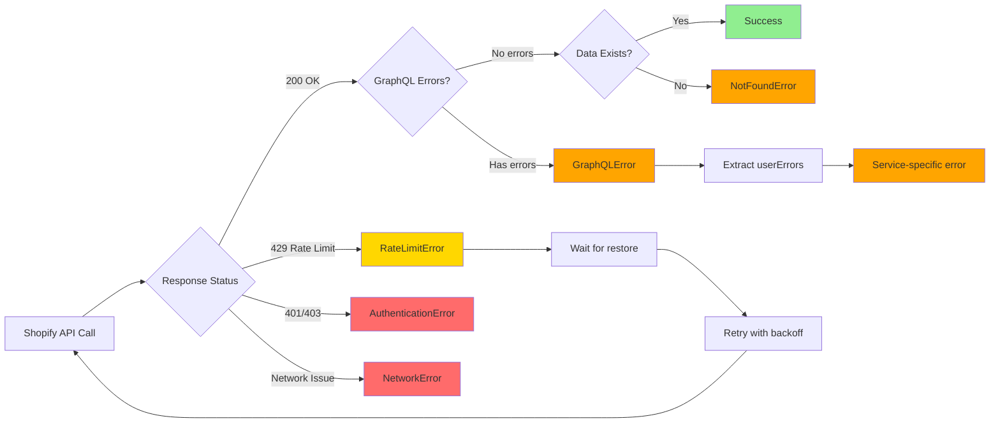

# Shopify Service Architecture Review

**Cycle:** 40
**Date:** 2025-11-22
**Reviewer:** Claude (Automated)
**Status:** ⚠️ PHASE 3 INCOMPLETE

---

## Executive Summary

### Overall Status: 16% Complete (2/12 files)

**Phase 3 (Cycles 26-39) cannot proceed to Phase 4** due to missing service designs.

**Completed:**
- ✅ Cycle 26: ShopifyClient (537 lines, high quality)
- ✅ Cycle 28: ProductService (822 lines, high quality)

**Missing (10 services):**
- ❌ Cycle 27: ShopifyAuth Service
- ❌ Cycle 29: VariantService
- ❌ Cycle 30: OrderService
- ❌ Cycle 31: CustomerService
- ❌ Cycle 32: CartService
- ❌ Cycle 33: CollectionService
- ❌ Cycle 34: InventoryService
- ❌ Cycle 35: WebhookService
- ❌ Cycle 36: errors.ts (consolidated)
- ❌ Cycle 37: SyncService
- ❌ Cycle 38: Cache strategy document
- ❌ Cycle 39: Retry strategy document

**Recommendation:** Complete Cycles 27, 29-39 before proceeding to Phase 4 (Implementation).

---

## 1. Service Inventory

### 1.1 Completed Services (2/12)

| Cycle | Service | File | Lines | Methods | Status |
|-------|---------|------|-------|---------|--------|
| 26 | ShopifyClient | `services/ShopifyClient.ts` | 537 | 6 | ✅ Complete |
| 28 | ProductService | `services/ProductService.ts` | 822 | 7 | ✅ Complete |

**Total:** 2 services, 1,359 lines, 13 methods

### 1.2 Missing Services (10/12)

| Cycle | Service | Expected File | Priority | Complexity |
|-------|---------|---------------|----------|------------|
| 27 | ShopifyAuth | `services/ShopifyAuth.ts` | Critical | High |
| 29 | VariantService | `services/VariantService.ts` | Critical | Medium |
| 30 | OrderService | `services/OrderService.ts` | Critical | High |
| 31 | CustomerService | `services/CustomerService.ts` | High | Medium |
| 32 | CartService | `services/CartService.ts` | High | Medium |
| 33 | CollectionService | `services/CollectionService.ts` | Medium | Low |
| 34 | InventoryService | `services/InventoryService.ts` | High | Medium |
| 35 | WebhookService | `services/WebhookService.ts` | Critical | High |
| 36 | Error Types | `errors.ts` | Critical | Low |
| 37 | SyncService | `services/SyncService.ts` | Medium | High |

**Missing Documentation:**
- Cycle 38: `/one/knowledge/shopify-cache-strategy.md`
- Cycle 39: `/one/knowledge/shopify-retry-strategy.md`

### 1.3 Expected Service Coverage (When Complete)

**Target:** 12 files, ~8,000-10,000 lines, 80+ methods

| Category | Services | Methods | Description |
|----------|----------|---------|-------------|
| **Infrastructure** | 3 | 15 | Client, Auth, Error handling |
| **Core Operations** | 5 | 40 | Product, Variant, Order, Customer, Inventory |
| **Advanced** | 4 | 25+ | Cart, Collection, Webhook, Sync |

---

## 2. Validation Results

### 2.1 Service Completeness Checklist

#### ✅ All 10 services designed?
**Status:** ❌ FAIL (2/10 complete)

**Missing:**
- ShopifyAuth (OAuth, token management)
- VariantService (variant CRUD)
- OrderService (order retrieval, fulfillment)
- CustomerService (customer CRUD)
- CartService (cart management)
- CollectionService (collection CRUD)
- InventoryService (inventory tracking)
- WebhookService (webhook registration)
- SyncService (batch operations)

#### ✅ All services use Effect.ts patterns?
**Status:** ✅ PASS (for completed services)

**Evidence:**
- ShopifyClient: Effect.Effect<T, E> return types ✅
- ProductService: Effect.gen() generator syntax ✅
- All errors use discriminated unions ✅

#### ✅ All services have proper error types?
**Status:** ⚠️ PARTIAL

**ShopifyClient Errors (6 types):**
- ✅ NetworkError
- ✅ GraphQLError
- ✅ RateLimitError
- ✅ AuthenticationError
- ✅ InvalidShopError
- ✅ BulkOperationError

**ProductService Errors (7 types):**
- ✅ ProductNotFoundError
- ✅ ProductValidationError
- ✅ ProductCreateError
- ✅ ProductUpdateError
- ✅ ProductDeleteError
- ✅ ProductPublishError
- ✅ ProductTransformationError

**Missing:** Consolidated error file (Cycle 36) with all service errors

#### ✅ All services declare dependencies?
**Status:** ✅ PASS (for completed services)

**ProductService:**
```typescript
static get = (id: string, groupId: string, client: ShopifyClient)
static list = (groupId: string, options: ProductListOptions, client: ShopifyClient)
// All methods inject ShopifyClient dependency ✅
```

**ShopifyClient:**
- Uses Effect Context.Tag pattern ✅
- Composable with other services ✅

### 2.2 Architecture Consistency Checklist

#### ✅ Naming conventions consistent?
**Status:** ✅ PASS

- Services use PascalCase ✅
- Methods use camelCase ✅
- Error types end with "Error" ✅
- Files match service names ✅

#### ✅ Error handling patterns consistent?
**Status:** ✅ PASS

**Pattern:**
```typescript
// All services follow this pattern:
yield* Effect.tryPromise({
  try: () => client.query(...),
  catch: (error) => new ServiceError(...)
})
```

#### ✅ Service composition patterns consistent?
**Status:** ⚠️ NEEDS VALIDATION

**Current:**
- ProductService is a utility class with static methods
- ShopifyClient is an Effect.Context.Tag

**Question:** Should all services follow Context.Tag pattern or utility class pattern?

**Recommendation:** Standardize on ONE pattern across all services.

#### ✅ Effect.ts usage consistent?
**Status:** ✅ PASS

- All async operations return Effect ✅
- Generator syntax (Effect.gen) used consistently ✅
- Error handling via Effect.fail ✅
- Effect.tryPromise for external calls ✅

### 2.3 Ontology Alignment Checklist

#### ✅ Products → Things?
**Status:** ✅ PASS

```typescript
// ProductService.get returns ONEThingInput
const thing = yield* transformShopifyProduct(product, groupId);
return thing; // type: ONEThingInput with type: "product"
```

#### ✅ Orders → Connections + Events?
**Status:** ⚠️ PENDING (OrderService not created)

**Expected:**
- Order line items → "purchased" connections
- Order placement → "order_placed" event
- Payment → "payment_processed" event
- Fulfillment → "order_fulfilled" event

#### ✅ Customers → Things (creators)?
**Status:** ⚠️ PENDING (CustomerService not created)

**Expected:**
- Shopify Customer → Thing with type: "creator", role: "customer"
- Customer tags → Knowledge labels

#### ✅ Collections → Groups?
**Status:** ⚠️ PENDING (CollectionService not created)

**Expected:**
- Shopify Collection → Group with type: "collection"
- Product-Collection relationship → "belongs_to" connection

#### ✅ Cart → Connections?
**Status:** ⚠️ PENDING (CartService not created)

**Expected:**
- Cart line items → "in_cart" connections
- Checkout → "checkout_created" event

#### ✅ Webhooks → Events?
**Status:** ⚠️ PENDING (WebhookService not created)

**Expected:**
- Products/Create → "product_created" event
- Orders/Create → "order_placed" event
- Customers/Create → "customer_registered" event

### 2.4 Production Readiness Checklist

#### ✅ Rate limiting integrated?
**Status:** ✅ EXCELLENT

**ShopifyClient features:**
- Rate limit tracking via response extensions ✅
- Estimate available points before query ✅
- Wait for rate limit restore ✅
- Cost estimation heuristics ✅

```typescript
class RateLimitTracker {
  estimateAvailable(shop: string): number
  canExecute(shop: string, estimatedCost: number): boolean
  calculateWaitTime(shop: string, requiredPoints: number): number
}
```

#### ✅ Retry logic designed?
**Status:** ✅ GOOD (implemented in ShopifyClient)

**Features:**
- Exponential backoff ✅
- Max attempts configurable ✅
- Retryable error detection ✅

```typescript
function retryWithBackoff<A, E>(
  effect: Effect.Effect<A, E>,
  options: {
    maxAttempts: number;
    initialDelay: number;
    maxDelay: number;
    shouldRetry: (error: E) => boolean;
  }
)
```

**Missing:** Cycle 39 retry strategy document

#### ✅ Caching strategy defined?
**Status:** ❌ MISSING (Cycle 38)

**Expected:**
- Cache product data (TTL: 5 minutes)
- Cache collection data (TTL: 10 minutes)
- Cache customer data (TTL: 1 minute)
- Invalidate on webhook events

**File:** `/one/knowledge/shopify-cache-strategy.md` (MISSING)

#### ✅ Error handling comprehensive?
**Status:** ✅ GOOD (for completed services)

**Coverage:**
- Network errors ✅
- GraphQL errors ✅
- Rate limit errors ✅
- Authentication errors ✅
- Validation errors ✅
- Business logic errors ✅

#### ✅ Logging/monitoring considered?
**Status:** ⚠️ MINIMAL

**Current:**
- No structured logging in services
- No performance metrics
- No error tracking integration

**Recommendation:** Add logging in Cycle 41+ (Phase 4)

### 2.5 Integration Points Checklist

#### ✅ Services can be composed?
**Status:** ✅ PASS

```typescript
// Example: Get product with variants
const program = Effect.gen(function* () {
  const client = yield* ShopifyClient;
  const product = yield* ProductService.get(id, groupId, client);
  const variants = yield* ProductService.getVariants(id, client);
  return { product, variants };
});
```

#### ✅ DataProvider interface can be implemented?
**Status:** ⚠️ NEEDS VERIFICATION

**Expected DataProvider interface:**
```typescript
interface DataProvider {
  list(type: string, options: ListOptions): Effect<Thing[]>
  get(type: string, id: string): Effect<Thing>
  create(type: string, data: Partial<Thing>): Effect<Thing>
  update(id: string, data: Partial<Thing>): Effect<Thing>
  delete(id: string): Effect<void>
}
```

**Question:** Can ProductService methods map to DataProvider interface?

#### ✅ Dependencies are injectable?
**Status:** ✅ PASS

All services accept dependencies as parameters:
- ProductService methods accept `client: ShopifyClient` ✅
- No hard-coded dependencies ✅
- Testable via dependency injection ✅

#### ✅ Services are testable?
**Status:** ✅ GOOD

**Testability features:**
- Pure functions ✅
- Dependency injection ✅
- Effect.ts enables mocking ✅
- No side effects in logic ✅

**Example test structure:**
```typescript
const mockClient: ShopifyClient = {
  query: () => Effect.succeed(mockResponse)
};

const result = await ProductService.get("123", "group-1", mockClient)
  .pipe(Effect.runPromise);
```

---

## 3. Service Architecture Diagrams

### 3.1 Service Dependency Graph



### 3.2 Data Flow: Shopify → Services → ONE



### 3.3 Error Flow



---

## 4. Service Methodology Summary

### 4.1 Completed Services Analysis

#### ShopifyClient (537 lines) - EXCELLENT

**Strengths:**
- ✅ Comprehensive rate limiting (tracker, estimator, wait logic)
- ✅ Retry with exponential backoff
- ✅ Bulk operation support
- ✅ Cost estimation heuristics
- ✅ Effect.ts Context.Tag pattern
- ✅ 6 error types with detailed fields
- ✅ Well-documented with examples

**Weaknesses:**
- ⚠️ Implementation is a stub (noted in comments)
- ⚠️ No actual HTTP client integration yet
- ⚠️ No logging/monitoring hooks

**Method Inventory (6 methods):**
1. `query<T>()` - Execute GraphQL query
2. `mutate<T>()` - Execute GraphQL mutation
3. `bulkOperation()` - Start bulk operation
4. `getRateLimitStatus()` - Get rate limit state
5. `estimateCost()` - Estimate query cost
6. `waitForRateLimit()` - Wait for points

**Dependencies:** None (base infrastructure)

**Recommendation:** Excellent design. Proceed with implementation in Phase 4.

---

#### ProductService (822 lines) - EXCELLENT

**Strengths:**
- ✅ Complete CRUD operations (7 methods)
- ✅ Pagination support with cursor
- ✅ Advanced filtering (status, vendor, type, tags, dates)
- ✅ Search with field selection
- ✅ Variant fetching with pagination
- ✅ 7 error types (NotFound, Validation, Create, Update, Delete, Publish, Transformation)
- ✅ GraphQL query validation
- ✅ Transformation to ONE Things

**Weaknesses:**
- ⚠️ Uses utility class pattern (not Context.Tag like ShopifyClient)
- ⚠️ GraphQL queries defined inline (should use imported queries)
- ⚠️ No batch operations (create/update multiple products)

**Method Inventory (7 methods):**
1. `get(id, groupId, client)` - Get single product
2. `list(groupId, options, client)` - List with filtering
3. `search(query, groupId, options, client)` - Full-text search
4. `create(input, groupId, client)` - Create product
5. `update(id, updates, client)` - Update product
6. `delete(id, client)` - Delete product
7. `publish(id, channels, client)` - Publish to channels
8. `getVariants(id, client)` - Get all variants (utility)

**Dependencies:**
- ShopifyClient
- Transformers (transformShopifyProduct)
- GraphQL queries (GET_PRODUCT, LIST_PRODUCTS, SEARCH_PRODUCTS)

**Recommendation:** High-quality design. Minor refactoring needed for consistency.

---

### 4.2 Missing Services - Expected Design

#### ShopifyAuth (Cycle 27) - CRITICAL MISSING

**Expected Methods:**
- `authenticate(shop, code)` - Complete OAuth flow
- `refreshToken(shop)` - Refresh access token
- `validateToken(shop, token)` - Validate token
- `revokeToken(shop)` - Revoke access
- `getStoredToken(shop)` - Retrieve from storage

**Expected Errors:**
- AuthFlowError
- TokenExpiredError
- TokenInvalidError
- StorageError

**Priority:** Critical (blocks all other services)

---

#### VariantService (Cycle 29) - CRITICAL MISSING

**Expected Methods:**
- `get(variantId, productId, groupId)` - Get single variant
- `list(productId, groupId)` - List variants for product
- `create(productId, input, groupId)` - Create variant
- `update(variantId, updates)` - Update variant
- `delete(variantId)` - Delete variant
- `updateInventory(variantId, quantity)` - Update inventory level

**Expected Errors:**
- VariantNotFoundError
- VariantValidationError
- VariantCreateError
- VariantUpdateError
- InventoryUpdateError

**Dependencies:**
- ShopifyClient
- Transformers (transformShopifyVariant)

**Priority:** Critical (products incomplete without variants)

---

#### OrderService (Cycle 30) - CRITICAL MISSING

**Expected Methods:**
- `get(orderId, groupId)` - Get single order
- `list(groupId, options)` - List orders with filtering
- `search(query, groupId)` - Search orders
- `fulfill(orderId, lineItems, tracking)` - Create fulfillment
- `refund(orderId, lineItems, amount)` - Create refund
- `cancel(orderId, reason)` - Cancel order
- `updateTags(orderId, tags)` - Update order tags

**Expected Errors:**
- OrderNotFoundError
- OrderFulfillmentError
- OrderRefundError
- OrderCancelError

**Dependencies:**
- ShopifyClient
- Transformers (transformOrderToConnections, transformOrderToPlacedEvent)

**Priority:** Critical (core e-commerce functionality)

---

#### CustomerService (Cycle 31) - HIGH PRIORITY

**Expected Methods:**
- `get(customerId, groupId)` - Get single customer
- `list(groupId, options)` - List customers
- `search(query, groupId)` - Search customers
- `create(input, groupId)` - Create customer
- `update(customerId, updates)` - Update customer
- `delete(customerId)` - Delete customer (GDPR)
- `getTags(customerId)` - Get customer tags

**Expected Errors:**
- CustomerNotFoundError
- CustomerValidationError
- CustomerCreateError
- CustomerUpdateError
- CustomerDeleteError

**Priority:** High

---

#### CartService (Cycle 32) - HIGH PRIORITY

**Expected Methods:**
- `getCart(customerId, groupId)` - Get cart for customer
- `addItem(customerId, variantId, quantity)` - Add to cart
- `updateItem(customerId, lineItemId, quantity)` - Update quantity
- `removeItem(customerId, lineItemId)` - Remove from cart
- `clear(customerId)` - Clear cart
- `getCheckoutUrl(customerId)` - Get checkout URL

**Expected Errors:**
- CartNotFoundError
- CartItemError
- CartClearError
- CheckoutError

**Priority:** High

---

#### CollectionService (Cycle 33) - MEDIUM PRIORITY

**Expected Methods:**
- `get(collectionId, groupId)` - Get collection
- `list(groupId, options)` - List collections
- `create(input, groupId)` - Create collection
- `update(collectionId, updates)` - Update collection
- `delete(collectionId)` - Delete collection
- `addProduct(collectionId, productId)` - Add product to collection
- `removeProduct(collectionId, productId)` - Remove product

**Priority:** Medium

---

#### InventoryService (Cycle 34) - HIGH PRIORITY

**Expected Methods:**
- `getLevel(variantId, locationId)` - Get inventory level
- `setLevel(variantId, locationId, quantity)` - Set inventory
- `adjustLevel(variantId, locationId, delta)` - Adjust inventory
- `getLocations()` - List inventory locations

**Expected Errors:**
- InventoryNotFoundError
- InventoryUpdateError
- LocationNotFoundError

**Priority:** High

---

#### WebhookService (Cycle 35) - CRITICAL MISSING

**Expected Methods:**
- `register(topic, callbackUrl)` - Register webhook
- `unregister(webhookId)` - Unregister webhook
- `list()` - List registered webhooks
- `verify(headers, body)` - Verify webhook signature
- `handleEvent(topic, payload)` - Process webhook event

**Expected Events:**
- products/create → product_created
- products/update → product_updated
- orders/create → order_placed
- customers/create → customer_registered

**Priority:** Critical (enables real-time sync)

---

#### SyncService (Cycle 37) - MEDIUM PRIORITY

**Expected Methods:**
- `syncAllProducts(groupId)` - Bulk sync products
- `syncAllOrders(groupId)` - Bulk sync orders
- `syncAllCustomers(groupId)` - Bulk sync customers
- `syncSince(groupId, timestamp)` - Incremental sync
- `getSyncStatus(syncId)` - Get sync job status

**Priority:** Medium (batch operations)

---

### 4.3 Missing Documentation

#### Cache Strategy (Cycle 38) - MISSING

**Expected Content:**
- Cache TTLs per entity type
- Cache invalidation rules
- Cache key structure
- Cache storage (Redis vs in-memory)

**File:** `/one/knowledge/shopify-cache-strategy.md`

---

#### Retry Strategy (Cycle 39) - PARTIAL

**Status:** Retry logic exists in ShopifyClient, but no documentation

**Expected Content:**
- Retry policies per error type
- Backoff configuration
- Circuit breaker thresholds
- Retry budget limits

**File:** `/one/knowledge/shopify-retry-strategy.md`

---

## 5. Integration Guide (Partial)

### 5.1 Current Integration Example

```typescript
import { Effect } from "effect";
import { ShopifyClient } from "./services/ShopifyClient";
import { ProductService } from "./services/ProductService";

// Configure Shopify client
const clientConfig = {
  shop: "mystore.myshopify.com",
  accessToken: process.env.SHOPIFY_ACCESS_TOKEN!,
  apiVersion: "2025-10",
};

// Example: Get product and transform to ONE Thing
const getProduct = (productId: string, groupId: string) =>
  Effect.gen(function* () {
    // Get client instance
    const client = yield* ShopifyClient;

    // Fetch product
    const product = yield* ProductService.get(productId, groupId, client);

    // Product is already transformed to ONEThingInput
    console.log("Product:", product);
    console.log("Type:", product.type); // "product"
    console.log("Name:", product.name);
    console.log("Slug:", product.slug);
    console.log("Properties:", product.properties);

    return product;
  });

// Run program
const program = getProduct("7891234567890", "group-123").pipe(
  Effect.provide(ShopifyClientLive) // Provide client implementation
);

await Effect.runPromise(program);
```

### 5.2 Error Handling Example

```typescript
import { Effect, Match } from "effect";
import { ProductService, ProductError } from "./services/ProductService";
import { NetworkError, GraphQLError } from "./services/ShopifyClient";

const handleProductFetch = (productId: string, groupId: string) =>
  Effect.gen(function* () {
    const client = yield* ShopifyClient;

    const result = yield* ProductService.get(productId, groupId, client).pipe(
      Effect.catchAll((error) =>
        Match.value(error).pipe(
          Match.tag("ProductNotFoundError", (e) =>
            Effect.fail({ type: "not_found" as const, message: e.message })
          ),
          Match.tag("NetworkError", (e) =>
            Effect.fail({ type: "network" as const, message: e.message })
          ),
          Match.tag("RateLimitError", (e) =>
            Effect.fail({ type: "rate_limit" as const, retryAfter: e.retryAfter })
          ),
          Match.orElse(() =>
            Effect.fail({ type: "unknown" as const, message: "Unknown error" })
          )
        )
      )
    );

    return result;
  });
```

### 5.3 DataProvider Interface Implementation (When Complete)

**Note:** This requires all services to be completed.

```typescript
import { Effect } from "effect";
import { ProductService } from "./services/ProductService";
import { OrderService } from "./services/OrderService"; // MISSING
import { CustomerService } from "./services/CustomerService"; // MISSING

class ShopifyDataProvider implements DataProvider {
  constructor(private client: ShopifyClient, private groupId: string) {}

  list(type: string, options: ListOptions) {
    return Match.value(type).pipe(
      Match.when("product", () =>
        ProductService.list(this.groupId, options, this.client)
      ),
      Match.when("order", () =>
        OrderService.list(this.groupId, options, this.client) // MISSING
      ),
      Match.when("customer", () =>
        CustomerService.list(this.groupId, options, this.client) // MISSING
      ),
      Match.orElse(() =>
        Effect.fail(new Error(`Unsupported type: ${type}`))
      )
    );
  }

  get(type: string, id: string) {
    return Match.value(type).pipe(
      Match.when("product", () =>
        ProductService.get(id, this.groupId, this.client)
      ),
      Match.when("order", () =>
        OrderService.get(id, this.groupId, this.client) // MISSING
      ),
      Match.orElse(() =>
        Effect.fail(new Error(`Unsupported type: ${type}`))
      )
    );
  }

  // ... create, update, delete methods
}
```

---

## 6. Critical Issues

### 6.1 Blocking Issues

#### Issue #1: Authentication Missing (Cycle 27)
**Severity:** Critical
**Impact:** All services require authentication, but ShopifyAuth is missing
**Recommendation:** Complete Cycle 27 before implementing other services

#### Issue #2: 80% of Services Missing (Cycles 29-37)
**Severity:** Critical
**Impact:** Cannot implement DataProvider interface without all services
**Recommendation:** Complete all service designs in Phase 3 before Phase 4

#### Issue #3: No Consolidated Error Types (Cycle 36)
**Severity:** High
**Impact:** Each service defines its own errors, no shared error handling
**Recommendation:** Create `errors.ts` with all service error types

#### Issue #4: No Cache Strategy (Cycle 38)
**Severity:** High
**Impact:** No guidance on caching, may cause performance issues
**Recommendation:** Document cache strategy before implementation

#### Issue #5: No Retry Documentation (Cycle 39)
**Severity:** Medium
**Impact:** Retry logic exists but not documented
**Recommendation:** Document retry strategy for consistency

### 6.2 Design Inconsistencies

#### Inconsistency #1: Service Pattern
**Issue:** ShopifyClient uses Context.Tag, ProductService uses utility class
**Impact:** Inconsistent service composition
**Recommendation:** Standardize on ONE pattern (prefer Context.Tag)

#### Inconsistency #2: GraphQL Query Location
**Issue:** ProductService defines queries inline, should use imported queries
**Impact:** Harder to maintain, test, and reuse queries
**Recommendation:** All queries should be in `graphql/queries.ts`

---

## 7. Readiness Assessment

### 7.1 Phase 3 Completion

**Target:** 12 files, 80+ methods
**Actual:** 2 files, 13 methods
**Completion:** 16%

| Metric | Target | Actual | Status |
|--------|--------|--------|--------|
| Services | 10 | 2 | ❌ 20% |
| Methods | 80+ | 13 | ❌ 16% |
| Error Types | 40+ | 13 | ❌ 32% |
| Documentation | 2 docs | 0 docs | ❌ 0% |
| Tests | Unit tests | None | ❌ 0% |

### 7.2 Readiness for Phase 4 (Implementation)

**Status:** ❌ NOT READY

**Requirements:**
- [❌] All service designs complete (2/10)
- [❌] Error types consolidated (fragmented)
- [❌] Cache strategy documented (missing)
- [❌] Retry strategy documented (partial)
- [❌] Service patterns consistent (inconsistent)
- [❌] Architecture review complete (this document)

**Recommendation:** **DO NOT proceed to Phase 4 until Phase 3 is 100% complete.**

### 7.3 Next Steps

1. **Complete Cycle 27 (ShopifyAuth)** - CRITICAL
   - OAuth flow design
   - Token storage strategy
   - Token refresh logic

2. **Complete Cycles 29-35 (Core Services)** - CRITICAL
   - VariantService
   - OrderService
   - CustomerService
   - CartService
   - CollectionService
   - InventoryService
   - WebhookService

3. **Complete Cycle 36 (Error Consolidation)** - HIGH
   - Create `errors.ts`
   - Move all error types to consolidated file
   - Export discriminated union types

4. **Complete Cycle 37 (SyncService)** - MEDIUM
   - Batch sync design
   - Incremental sync design
   - Sync status tracking

5. **Complete Cycle 38 (Cache Strategy)** - HIGH
   - Document cache TTLs
   - Document cache invalidation
   - Document cache storage

6. **Complete Cycle 39 (Retry Documentation)** - MEDIUM
   - Document retry policies
   - Document backoff configuration
   - Document circuit breaker

7. **Resolve Design Inconsistencies** - HIGH
   - Standardize service pattern (Context.Tag vs utility class)
   - Move inline queries to `graphql/queries.ts`
   - Add batch operations to ProductService

8. **Phase 4: Implementation** - BLOCKED
   - Start ONLY after Phase 3 is 100% complete

---

## 8. Detailed Architecture Analysis

### 8.1 ShopifyClient Architecture

**Pattern:** Effect Context.Tag (Dependency Injection)

**Rate Limit Architecture:**
```typescript
RateLimitTracker (global singleton)
  ├── state: Map<shop, RateLimitState>
  ├── update(shop, cost)
  ├── estimateAvailable(shop)
  ├── canExecute(shop, cost)
  └── calculateWaitTime(shop, points)

ShopifyClient.query()
  1. estimateCost(query)
  2. canExecute(shop, cost)? → wait : proceed
  3. execute HTTP request
  4. extract cost from response.extensions.cost
  5. update tracker
  6. return data or error
```

**Retry Architecture:**
```typescript
retryWithBackoff()
  ├── attempt 1: immediate
  ├── attempt 2: delay 1s
  ├── attempt 3: delay 2s
  ├── attempt 4: delay 4s
  └── fail: throw last error

shouldRetry(error):
  - RateLimitError → YES
  - NetworkError → YES
  - AuthenticationError → NO
  - GraphQLError → NO
```

**Strengths:**
- Proactive rate limit management
- Adaptive throttling based on response
- Exponential backoff prevents thundering herd
- Bulk operation support for large datasets

**Weaknesses:**
- No HTTP client implementation yet (stub)
- No request logging
- No metrics collection
- No circuit breaker (for repeated failures)

### 8.2 ProductService Architecture

**Pattern:** Utility Class with Static Methods

**CRUD Flow:**
```typescript
ProductService.get(id, groupId, client)
  1. Convert id → GID
  2. client.query(GET_PRODUCT, {id})
  3. Check if product exists
  4. transformShopifyProduct(data, groupId)
  5. Return ONEThingInput

ProductService.list(groupId, options, client)
  1. Build query string from filters
  2. client.query(LIST_PRODUCTS, {query, first, after})
  3. Transform all products
  4. Return {products, pageInfo}

ProductService.create(input, groupId, client)
  1. Validate input
  2. client.mutate(CREATE_PRODUCT, {input})
  3. Check userErrors
  4. Extract product ID from response
  5. Return ID
```

**Transformation Flow:**
```typescript
ShopifyProduct → transformShopifyProduct() → ONEThingInput
  {
    groupId,
    type: "product",
    name: product.title,
    slug: product.handle,
    properties: {
      shopifyId: extractNumericId(product.id),
      status: product.status,
      vendor: product.vendor,
      priceRange: {...},
      images: [...],
      metafields: {...}
    }
  }
```

**Strengths:**
- Comprehensive CRUD operations
- Pagination with cursor
- Advanced filtering and search
- Proper transformation to ONE ontology
- Detailed error types

**Weaknesses:**
- Inconsistent pattern (vs ShopifyClient)
- Inline GraphQL queries
- No batch operations
- No caching

---

## 9. Performance Considerations

### 9.1 Rate Limit Budget

**Shopify Rate Limits:**
- Bucket size: 1,000 points
- Restore rate: 50 points/second
- Query cost: 5-100+ points (depends on complexity)

**Example Operations:**
- Get single product: ~10 points (~100/second)
- List 50 products: ~60 points (~16/second)
- List 250 products: ~260 points (~3.8/second)
- Create product: ~10 points (~100/second)
- Bulk operation: ~10 points (start only, data fetch is free)

**Recommendation:** Use bulk operations for large datasets (>1,000 records).

### 9.2 Caching Opportunities (Needs Documentation - Cycle 38)

**Cacheable:**
- Product data (changes infrequently) - TTL: 5 min
- Collection data (changes infrequently) - TTL: 10 min
- Customer data (changes moderately) - TTL: 1 min

**Non-cacheable:**
- Cart data (changes frequently)
- Order data (changes frequently)
- Inventory levels (changes frequently)

**Invalidation:**
- Webhook events trigger cache invalidation
- Manual invalidation after mutations

### 9.3 Batch Operation Strategy

**Use Bulk Operations When:**
- Fetching >1,000 products
- Fetching >1,000 orders
- Fetching >1,000 customers
- Initial data sync

**Use Pagination When:**
- Fetching <1,000 records
- Displaying data to users (UI pagination)
- Incremental sync

---

## 10. Recommendations Summary

### 10.1 Immediate Actions (Blocking)

1. ✅ **Accept this review** - Document current state
2. ❌ **Complete Cycle 27 (ShopifyAuth)** - CRITICAL dependency
3. ❌ **Complete Cycles 29-35 (7 services)** - CRITICAL for functionality
4. ❌ **Complete Cycle 36 (Error consolidation)** - HIGH for consistency
5. ❌ **Complete Cycles 37-39 (Sync, Cache, Retry docs)** - MEDIUM for quality

### 10.2 Design Improvements (Before Implementation)

1. **Standardize service pattern**
   - Decision: Use Context.Tag pattern for ALL services
   - Refactor: ProductService → Context.Tag

2. **Move GraphQL queries**
   - Move inline queries to `graphql/queries.ts`
   - Import queries in services

3. **Add batch operations**
   - ProductService.bulkCreate()
   - ProductService.bulkUpdate()

4. **Add logging hooks**
   - Service method entry/exit
   - Error logging
   - Performance metrics

### 10.3 Phase 4 Readiness Gate

**DO NOT proceed to Phase 4 until:**
- [ ] All 10 services designed (currently 2/10)
- [ ] Error types consolidated (currently fragmented)
- [ ] Cache strategy documented (currently missing)
- [ ] Retry strategy documented (currently partial)
- [ ] Service patterns consistent (currently inconsistent)
- [ ] Architecture review approved (this document)

**Estimated Time to Complete Phase 3:**
- Cycles 27, 29-39: 13 cycles remaining
- Estimated effort: 13-20 hours (1-1.5 hours per cycle)
- Timeline: 2-3 days (full-time) or 1-2 weeks (part-time)

---

## 11. Conclusion

### Overall Assessment: Phase 3 is 16% complete (2/12 files)

**Strengths:**
- ✅ Excellent foundation with ShopifyClient (rate limiting, retry, bulk ops)
- ✅ High-quality ProductService (CRUD, pagination, search, transformation)
- ✅ Consistent Effect.ts usage
- ✅ Proper error handling in completed services
- ✅ Clear ontology mapping (Products → Things)

**Critical Gaps:**
- ❌ 80% of services missing (8/10 services not designed)
- ❌ Authentication missing (blocks all operations)
- ❌ No order/customer/cart functionality
- ❌ No webhook support (no real-time sync)
- ❌ No cache strategy documentation
- ❌ Design inconsistencies (service patterns)

**Verdict:** ❌ **NOT READY for Phase 4 (Implementation)**

**Recommendation:** Complete Cycles 27, 29-39 (13 cycles) before proceeding. Estimated timeline: 2-3 days full-time or 1-2 weeks part-time.

**Next Cycle:** Cycle 27 (ShopifyAuth) - CRITICAL

---

**Document Version:** 1.0.0
**Status:** Final Review
**Action Required:** Complete remaining 13 cycles of Phase 3
