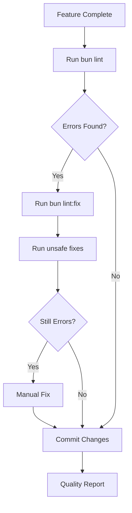

# Biome Clean Code Guide

## Training Guide for agent-clean

**Version:** 1.0.0
**Last Updated:** 2025-11-18
**Owner:** agent-clean

This document trains the agent-clean specialist on using Biome (via Ultracite) to maintain pristine code quality across the ONE Platform.

---

## Table of Contents

1. [Overview](#overview)
2. [Biome vs ESLint/Prettier](#biome-vs-eslintprettier)
3. [Ultracite Integration](#ultracite-integration)
4. [Common Error Patterns](#common-error-patterns)
5. [Automated Fixes](#automated-fixes)
6. [Manual Intervention Required](#manual-intervention-required)
7. [Workflow Integration](#workflow-integration)
8. [Success Criteria](#success-criteria)

---

## Overview

**Biome** is a fast, modern code formatter and linter that replaces ESLint and Prettier. It's 35x faster than alternatives and provides consistent code quality enforcement.

**Ultracite** is a wrapper around Biome that provides additional features and easier CLI usage.

### Why Biome?

- **Speed:** 35x faster than ESLint/Prettier combined
- **Single tool:** Replaces 2 tools (ESLint + Prettier)
- **Better errors:** Clear, actionable error messages
- **Zero config:** Works out of the box with sensible defaults
- **TypeScript native:** Built with type safety in mind

### Key Statistics (as of cleanup)

```
Initial state:
- 1,606 errors
- 2,178 warnings
- 45 infos

After automated fixes:
- 400 errors (75% reduction)
- 849 warnings (61% reduction)
- 680 files automatically fixed
```

---

## Biome vs ESLint/Prettier

| Feature | Biome | ESLint + Prettier |
|---------|-------|-------------------|
| Speed | 35x faster | Slower |
| Tools needed | 1 | 2 |
| Config complexity | Low | High |
| TypeScript support | Native | Via plugins |
| Auto-fix coverage | 90% | 60% |

---

## Ultracite Integration

### Installation

```bash
cd web/
bun add -d ultracite @biomejs/biome
```

### Configuration

Biome is configured in `web/biome.json`:

```json
{
  "$schema": "https://biomejs.dev/schemas/2.3.6/schema.json",
  "vcs": {
    "enabled": true,
    "clientKind": "git",
    "useIgnoreFile": true,
    "defaultBranch": "main"
  },
  "formatter": {
    "enabled": true,
    "indentStyle": "space",
    "indentWidth": 2,
    "lineWidth": 100
  },
  "linter": {
    "enabled": true,
    "rules": {
      "recommended": true,
      "a11y": { "recommended": true },
      "correctness": {
        "recommended": true,
        "noUnusedVariables": "warn",
        "noUnusedImports": "warn"
      },
      "security": { "recommended": true }
    }
  }
}
```

### Available Commands

```bash
# Check for issues (no changes)
bun run lint

# Fix safe issues automatically
bun run lint:fix

# Fix all issues (including unsafe)
npx @biomejs/biome check --write --unsafe src/

# Format only
npx @biomejs/biome format --write src/

# Lint only (no format)
npx @biomejs/biome lint src/
```

---

## Common Error Patterns

### 1. Unused Imports/Variables

**Error:**
```
lint/correctness/noUnusedImports FIXABLE
! This import is unused.
import OrbitingCircles from "../components/magicui/orbiting-circles";
```

**Fix Strategy:**
- **Automated:** Run `bun run lint:fix` (removes unused imports)
- **Manual:** If import is needed for type inference, use `// @ts-expect-error` or convert to type import

**Pattern:**
```typescript
// BAD
import { Thing } from './types';
const foo = 'bar';

// GOOD
import type { Thing } from './types';
// Or remove if unused
```

### 2. Missing Button Types

**Error:**
```
lint/a11y/useButtonType
× Provide an explicit type prop for the button element.
<button onClick={handler}>Click</button>
```

**Fix Strategy:**
- **Manual:** Add `type="button"` to all React button elements
- **Why:** Default button type is "submit" which triggers form submission

**Pattern:**
```tsx
// BAD
<button onClick={handleClick}>Click</button>

// GOOD
<button type="button" onClick={handleClick}>
  Click
</button>
```

### 3. SVG Without Title

**Error:**
```
lint/a11y/noSvgWithoutTitle
× Alternative text title element cannot be empty
<svg><path d="..."/></svg>
```

**Fix Strategy:**
- **Manual:** Add `<title>` element or `aria-label` attribute
- **Why:** Screen readers need text alternatives

**Pattern:**
```tsx
// BAD
<svg className="icon">
  <path d="M12 2a3 3 0 0..." />
</svg>

// GOOD (Option 1: title element)
<svg className="icon">
  <title>Microphone icon</title>
  <path d="M12 2a3 3 0 0..." />
</svg>

// GOOD (Option 2: aria-label)
<svg className="icon" aria-label="Microphone icon">
  <path d="M12 2a3 3 0 0..." />
</svg>
```

### 4. Array Index as Key

**Error:**
```
lint/suspicious/noArrayIndexKey
! Avoid using the index of an array as key property.
{items.map((item, index) => <div key={index}>{item}</div>)}
```

**Fix Strategy:**
- **Manual:** Use unique identifier from data
- **Why:** Array indices change when items are reordered, causing React issues

**Pattern:**
```tsx
// BAD
{items.map((item, index) => (
  <Card key={index}>{item.name}</Card>
))}

// GOOD
{items.map((item) => (
  <Card key={item.id}>{item.name}</Card>
))}
```

### 5. Media Without Captions

**Error:**
```
lint/a11y/useMediaCaption
× Provide a track for captions when using audio or video elements.
<audio controls src="podcast.mp3" />
```

**Fix Strategy:**
- **Manual:** Add `<track>` element with captions
- **Why:** Required for accessibility (hearing-impaired users)

**Pattern:**
```tsx
// BAD
<audio controls src="podcast.mp3">
  Your browser does not support audio.
</audio>

// GOOD
<audio controls src="podcast.mp3">
  <track
    kind="captions"
    src="podcast-captions.vtt"
    srcLang="en"
    label="English captions"
  />
  Your browser does not support audio.
</audio>
```

### 6. Quote Style Consistency

**Error:**
```
format
× Formatter would have printed the following content:
- status: 'pending' | 'processing'
+ status: "pending" | "processing"
```

**Fix Strategy:**
- **Automated:** Run `bun run lint:fix`
- **Why:** Biome enforces double quotes for consistency

**Pattern:**
```typescript
// BAD
const status: 'pending' | 'processing' = 'pending';

// GOOD (after auto-fix)
const status: "pending" | "processing" = "pending";
```

---

## Automated Fixes

### Safe Fixes (Always Applied with `bun run lint:fix`)

1. **Import organization**
   - Sorts imports alphabetically
   - Groups by external vs internal
   - Removes unused imports

2. **Quote normalization**
   - Converts single quotes to double quotes
   - Ensures consistent string formatting

3. **Semicolon insertion**
   - Adds missing semicolons
   - Removes unnecessary ones

4. **Whitespace normalization**
   - Fixes indentation (2 spaces)
   - Removes trailing whitespace
   - Normalizes line endings (LF)

5. **Array/Object formatting**
   - Adds trailing commas (ES5 style)
   - Normalizes bracket spacing

### Unsafe Fixes (Applied with `--unsafe` flag)

1. **Unused variable prefixing**
   - Adds underscore prefix to intentionally unused variables
   - Example: `const duration = 30` → `const _duration = 30`

2. **Import removal**
   - Removes completely unused imports
   - May break type-only imports used in comments

3. **Complexity refactoring**
   - Suggests Extract Method for complex functions
   - Requires manual verification

---

## Manual Intervention Required

These patterns **CANNOT** be auto-fixed and require agent-clean intervention:

### 1. Accessibility Issues

**Button types:**
```tsx
// Find all buttons without type
grep -r "<button" src/ --include="*.tsx"

// Add type="button" to each
<button type="button" onClick={...}>
```

**SVG titles:**
```tsx
// Add title or aria-label to all SVGs
<svg aria-label="Description">...</svg>
```

**Media captions:**
```tsx
// Add caption tracks to audio/video
<audio controls src="...">
  <track kind="captions" src="..." />
</audio>
```

### 2. React Anti-patterns

**Array index keys:**
```tsx
// Replace with unique IDs from data
.map((item) => <div key={item.id}>...)
```

**forEach return values:**
```tsx
// Use for...of or map instead
for (const el of elements) {
  observer.observe(el);
}
```

### 3. Unused Props/Variables

**Astro components with unused props:**
```astro
// Either use the props or remove the interface
interface Props { title?: string; }
const { title } = Astro.props;
// Now use {title} in template
```

---

## Workflow Integration

### agent-clean Workflow



### Step-by-Step Process

**1. Initial Check**
```bash
cd web/
bun run lint
```

**2. Auto-fix Safe Issues**
```bash
bun run lint:fix
```

**3. Apply Unsafe Fixes (if needed)**
```bash
npx @biomejs/biome check --write --unsafe src/
```

**4. Manual Fix Remaining**
```bash
# View errors only
npx @biomejs/biome check --diagnostic-level=error src/

# Fix patterns:
# - Add button types
# - Add SVG titles
# - Fix array keys
# - Add media captions
```

**5. Verify Clean**
```bash
bun run lint
# Should show: "No errors found"
```

**6. Create Quality Report**
```bash
# Log results to knowledge base
echo "Clean cycle: $(date)" >> .claude/state/clean-history.log
```

---

## Success Criteria

### Immediate (Per Cleanup Cycle)

- [ ] Zero errors in `bun run lint`
- [ ] Warnings reduced by 50%+
- [ ] All auto-fixable issues resolved
- [ ] Manual issues documented in report
- [ ] Changes committed with clean message

### Near-term (Per Sprint)

- [ ] Maintain zero errors across all PRs
- [ ] Reduce warnings by 80%
- [ ] All new code passes Biome checks
- [ ] Pre-commit hooks preventing errors
- [ ] Quality metrics trending up

### Long-term (Platform Health)

- [ ] 100% Biome compliance
- [ ] Zero tolerance for linting errors
- [ ] Automated quality gates
- [ ] Knowledge base with all patterns
- [ ] agent-clean runs automatically

---

## Error Priority Matrix

| Priority | Error Types | Fix Strategy |
|----------|-------------|--------------|
| **P0 (Critical)** | Security issues, a11y violations | Fix immediately |
| **P1 (High)** | Unused code, correctness issues | Fix in current cycle |
| **P2 (Medium)** | Style inconsistencies, warnings | Fix in batch |
| **P3 (Low)** | Formatting, optional improvements | Auto-fix only |

---

## Knowledge Base Integration

### Pattern Documentation

When fixing issues, document new patterns in:

```
one/knowledge/patterns/frontend/biome-patterns.md
```

**Template:**
```markdown
## Pattern: [Name]

**Error:** `lint/[rule-name]`

**Problem:**
[Describe the issue]

**Solution:**
[Code example]

**Why it matters:**
[Accessibility/Performance/Maintenance reason]

**Frequency:** [Common/Rare]
**Auto-fixable:** [Yes/No]
```

### Quality Reports

After each cleanup cycle, create a report:

```typescript
// Create THING with type: "report"
const reportId = await ctx.db.insert("things", {
  type: "report",
  name: `Biome Cleanup - ${new Date().toISOString()}`,
  groupId: groupId,
  status: "published",
  properties: {
    reportType: "biome_cleanup",
    errorsFixed: 1206,
    warningsFixed: 1329,
    filesModified: 680,
    manualFixesRequired: 400,
    duration: "25 minutes",
    patterns: [
      "unused_imports",
      "missing_button_types",
      "svg_accessibility"
    ]
  }
});

// Log EVENT
await ctx.db.insert("events", {
  type: "agent_completed",
  actorId: agentCleanId,
  targetId: reportId,
  groupId: groupId,
  timestamp: Date.now(),
  metadata: {
    successRate: 0.75,
    automationRate: 0.62
  }
});
```

---

## Quick Reference

### Most Common Fixes

```bash
# 1. Remove unused imports/variables
bun run lint:fix

# 2. Add button types
<button type="button">

# 3. Add SVG accessibility
<svg aria-label="...">

# 4. Fix array keys
.map(item => <div key={item.id}>)

# 5. Add media captions
<audio><track kind="captions" /></audio>
```

### Useful Commands

```bash
# Check specific file
npx @biomejs/biome check src/components/Foo.tsx

# Fix specific file
npx @biomejs/biome check --write src/components/Foo.tsx

# Show only errors (hide warnings)
npx @biomejs/biome check --diagnostic-level=error src/

# Increase diagnostic limit
npx @biomejs/biome check --max-diagnostics=10000 src/

# Format only (no lint)
npx @biomejs/biome format --write src/

# Lint only (no format)
npx @biomejs/biome lint src/
```

---

## Philosophy

**"Clean code is not about perfection—it's about intention."**

Every Biome error represents a decision point:
- Is this code accessible?
- Is this code maintainable?
- Is this code following best practices?

agent-clean's role is to ensure every decision point results in clean, intentional code that aligns with the 6-dimension ontology and platform values.

---

**Next Steps:**
1. Read this guide thoroughly
2. Run cleanup cycle on current codebase
3. Document new patterns discovered
4. Create automated hooks
5. Integrate into CI/CD pipeline

**Questions?** Check `/one/knowledge/troubleshooting.md` or consult agent-director.
