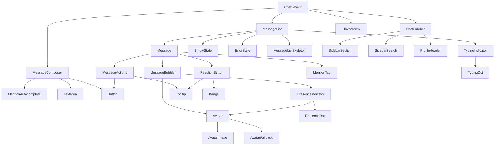

# Chat Platform Component Architecture

**Version:** 1.0.0
**Created:** 2025-11-22
**Pattern:** Atomic Design + 6-Dimension Ontology

## Overview

Component hierarchy for the ONE Platform chat system, organized by Atomic Design principles and mapped to the 6-dimension ontology.

---

## Atomic Design Layers

### **Atoms** (Smallest UI building blocks)

```typescript
// shadcn/ui primitives (DO NOT MODIFY)
- Avatar, AvatarImage, AvatarFallback  // User profile pictures
- Badge                                 // Status badges, counts
- Button                                // All clickable actions
- Input                                 // Text input fields
- Skeleton                              // Loading placeholders
- Separator                             // Visual dividers
- Tooltip                               // Hover help text
```

**Custom Atoms:**

```typescript
// web/src/components/chat/atoms/
PresenceDot.tsx           // Online status indicator (🟢🟡🔴⚫)
MentionBadge.tsx          // @mention styling component
TypingDot.tsx             // Single bouncing dot animation
LoadingSpinner.tsx        // Circular loading indicator
```

### **Molecules** (Simple component combinations)

```typescript
// web/src/components/chat/molecules/
MessageBubble.tsx         // Avatar + content + timestamp
MentionTag.tsx            // @username with click handler
TypingIndicator.tsx       // "X is typing..." with bouncing dots
PresenceIndicator.tsx     // Avatar + presence dot
ReactionButton.tsx        // Emoji + count badge
MessageActions.tsx        // Hover action buttons (react, reply, more)
```

**MessageBubble.tsx:**
```typescript
interface MessageBubbleProps {
  avatar: string;
  username: string;
  content: string;
  timestamp: Date;
  showAvatar?: boolean;
  showTimestamp?: boolean;
}

export function MessageBubble({
  avatar,
  username,
  content,
  timestamp,
  showAvatar = true,
  showTimestamp = true
}: MessageBubbleProps) {
  return (
    <div className="flex gap-3">
      {showAvatar && (
        <Avatar>
          <AvatarImage src={avatar} />
          <AvatarFallback>{username[0]}</AvatarFallback>
        </Avatar>
      )}
      <div className="flex-1">
        {showTimestamp && (
          <div className="flex gap-2 items-baseline">
            <span className="font-semibold">{username}</span>
            <span className="text-xs text-muted-foreground">
              {formatTime(timestamp)}
            </span>
          </div>
        )}
        <div className="text-sm">{content}</div>
      </div>
    </div>
  );
}
```

**TypingIndicator.tsx:**
```typescript
interface TypingIndicatorProps {
  users: Array<{ name: string }>;
}

export function TypingIndicator({ users }: TypingIndicatorProps) {
  if (users.length === 0) return null;

  const text =
    users.length === 1
      ? `${users[0].name} is typing...`
      : users.length === 2
      ? `${users[0].name} and ${users[1].name} are typing...`
      : `${users[0].name}, ${users[1].name}, and ${users.length - 2} others are typing...`;

  return (
    <div className="flex items-center gap-2 text-sm text-muted-foreground px-4 py-2">
      <span>{text}</span>
      <div className="flex gap-1">
        <TypingDot delay={0} />
        <TypingDot delay={0.2} />
        <TypingDot delay={0.4} />
      </div>
    </div>
  );
}
```

### **Organisms** (Complex feature components)

```typescript
// web/src/components/chat/organisms/
MessageList.tsx           // Infinite scroll message container
Message.tsx               // Full message with reactions, editing, actions
MessageComposer.tsx       // Input + autocomplete + send button
MentionAutocomplete.tsx   // @mention dropdown suggestions
ThreadView.tsx            // Threaded replies sidebar
ChatSidebar.tsx           // 7-section navigation sidebar
```

**MessageList.tsx:**
```typescript
interface MessageListProps {
  channelId: string;
  onThreadClick?: (messageId: string) => void;
}

export function MessageList({ channelId, onThreadClick }: MessageListProps) {
  const scrollRef = useRef<HTMLDivElement>(null);
  const [showScrollToBottom, setShowScrollToBottom] = useState(false);

  // Real-time messages from Convex
  const messages = useQuery(api.queries.getChannelMessages, { channelId });
  const typingUsers = useQuery(api.queries.getTypingUsers, { channelId });

  // Loading state
  if (messages === undefined) {
    return <MessageListSkeleton count={5} />;
  }

  // Error state
  if (messages === null) {
    return <ErrorState type="channel-not-found" />;
  }

  // Empty state
  if (messages.length === 0) {
    return <EmptyState type="no-messages" />;
  }

  // Group messages by proximity
  const grouped = groupMessages(messages);

  return (
    <div className="relative h-full">
      <div ref={scrollRef} className="h-full overflow-y-auto p-6">
        {grouped.map((group, i) => (
          <div key={i} className="space-y-1">
            {group.map((msg, j) => (
              <Message
                key={msg._id}
                message={msg}
                showAvatar={j === 0}
                showTimestamp={j === 0}
                onThreadClick={() => onThreadClick?.(msg._id)}
              />
            ))}
          </div>
        ))}

        <TypingIndicator users={typingUsers} />
      </div>

      {showScrollToBottom && (
        <Button
          onClick={scrollToBottom}
          className="absolute bottom-4 right-4 rounded-full shadow-lg"
        >
          <ArrowDown className="h-4 w-4" />
        </Button>
      )}
    </div>
  );
}
```

**MessageComposer.tsx:**
```typescript
interface MessageComposerProps {
  channelId: string;
  placeholder?: string;
  maxLength?: number;
}

export function MessageComposer({
  channelId,
  placeholder = "Type a message...",
  maxLength = 4000
}: MessageComposerProps) {
  const [content, setContent] = useState("");
  const [showAutocomplete, setShowAutocomplete] = useState(false);
  const [mentionQuery, setMentionQuery] = useState("");

  const sendMessage = useMutation(api.mutations.sendMessage);
  const updateTyping = useMutation(api.mutations.updateTypingStatus);

  const handleKeyDown = (e: React.KeyboardEvent) => {
    if (e.key === "Enter" && !e.shiftKey) {
      e.preventDefault();
      handleSend();
    }

    if (e.key === "@") {
      setShowAutocomplete(true);
    }

    if (e.key === "Escape") {
      setShowAutocomplete(false);
    }
  };

  const handleChange = (e: React.ChangeEvent<HTMLTextAreaElement>) => {
    setContent(e.target.value);

    // Trigger typing indicator
    updateTyping({ channelId, isTyping: true });

    // Detect @mentions
    const cursorPos = e.target.selectionStart;
    const textBeforeCursor = e.target.value.substring(0, cursorPos);
    const match = textBeforeCursor.match(/@(\w*)$/);

    if (match) {
      setMentionQuery(match[1]);
      setShowAutocomplete(true);
    } else {
      setShowAutocomplete(false);
    }
  };

  const handleSend = async () => {
    if (!content.trim()) return;

    await sendMessage({
      channelId,
      content: content.trim(),
      mentions: extractMentions(content)
    });

    setContent("");
    updateTyping({ channelId, isTyping: false });
  };

  return (
    <div className="relative border-t p-4">
      {showAutocomplete && (
        <MentionAutocomplete
          query={mentionQuery}
          onSelect={(username) => insertMention(username)}
          onClose={() => setShowAutocomplete(false)}
        />
      )}

      <Textarea
        value={content}
        onChange={handleChange}
        onKeyDown={handleKeyDown}
        placeholder={placeholder}
        maxLength={maxLength}
        className="min-h-[80px] resize-none"
        data-testid="message-input"
      />

      <div className="flex justify-between items-center mt-2">
        <span className="text-xs text-muted-foreground">
          {content.length} / {maxLength}
        </span>
        <Button
          onClick={handleSend}
          disabled={!content.trim()}
          data-testid="send-button"
        >
          Send <Send className="ml-2 h-4 w-4" />
        </Button>
      </div>
    </div>
  );
}
```

### **Templates** (Page-level layouts)

```typescript
// web/src/components/chat/templates/
ChatLayout.tsx            // 3-column layout (sidebar + messages + thread)
MentionsLayout.tsx        // Mentions feed view
SearchLayout.tsx          // Search results view
```

**ChatLayout.tsx:**
```typescript
interface ChatLayoutProps {
  channelId?: string;
  threadId?: string;
}

export function ChatLayout({ channelId, threadId }: ChatLayoutProps) {
  return (
    <div className="flex h-screen">
      {/* Sidebar */}
      <ChatSidebar />

      {/* Main content */}
      <div className="flex-1 flex flex-col">
        <MessageList
          channelId={channelId}
          onThreadClick={(id) => router.push(`/chat/${channelId}/thread/${id}`)}
        />
        <MessageComposer channelId={channelId} />
      </div>

      {/* Thread (optional) */}
      {threadId && (
        <div className="w-[400px] border-l">
          <ThreadView threadId={threadId} />
        </div>
      )}
    </div>
  );
}
```

---

## Component Dependency Graph



---

## State Management Architecture

### **Nanostores** (Global client state)

```typescript
// web/src/stores/chat.ts
export const chatSidebarStore = persistentAtom<SidebarState>('chat-sidebar', {
  collapsed: false,
  sectionOrder: ['stream', 'organisations', 'groups', 'channels', 'tools', 'agents', 'people'],
  hiddenSections: []
});

export const chatSidebarActions = {
  toggleCollapsed: () => {
    chatSidebarStore.set({
      ...chatSidebarStore.get(),
      collapsed: !chatSidebarStore.get().collapsed
    });
  },
  reorderSections: (newOrder: string[]) => {
    chatSidebarStore.set({
      ...chatSidebarStore.get(),
      sectionOrder: newOrder
    });
  }
};
```

### **Convex Queries** (Real-time backend data)

```typescript
// All components use Convex for real-time data
import { useQuery, useMutation } from 'convex/react';

// Messages
const messages = useQuery(api.queries.getChannelMessages, { channelId });

// Typing indicators
const typingUsers = useQuery(api.queries.getTypingUsers, { channelId });

// Presence
const onlineUsers = useQuery(api.queries.getOnlineUsers, { groupId });

// Mutations
const sendMessage = useMutation(api.mutations.sendMessage);
const addReaction = useMutation(api.mutations.addReaction);
const updateTyping = useMutation(api.mutations.updateTypingStatus);
```

---

## Component Props Patterns

### **Ontology-Aligned Props**

```typescript
// Thing dimension
interface ThingCardProps {
  thing: Thing;
  type: 'message' | 'channel' | 'thread';
  variant?: 'default' | 'compact' | 'highlighted';
}

// Person dimension
interface PersonCardProps {
  person: Person;
  showPresence?: boolean;
  showRole?: boolean;
}

// Event dimension
interface EventItemProps {
  event: Event;
  compact?: boolean;
}

// Connection dimension
interface ConnectionBadgeProps {
  connection: Connection;
  type: 'member' | 'follower' | 'thread-participant';
}
```

### **Callback Props Pattern**

```typescript
// Consistent event handler naming
interface ComponentProps {
  onSelect?: (id: string) => void;       // Select item
  onClick?: () => void;                   // Click action
  onChange?: (value: string) => void;     // Value changed
  onSubmit?: (data: FormData) => void;   // Form submitted
  onClose?: () => void;                   // Close modal/dropdown
  onCancel?: () => void;                  // Cancel action
}
```

---

## Accessibility Architecture

### **ARIA Roles**

```typescript
// MessageList.tsx
<div role="log" aria-label="Chat messages" aria-live="polite">
  {messages.map(...)}
</div>

// MessageComposer.tsx
<form role="form" aria-label="Send message">
  <Textarea aria-label="Message content" />
  <Button aria-label="Send message">Send</Button>
</form>

// MentionAutocomplete.tsx
<div role="listbox" aria-label="Mention suggestions">
  {users.map(user => (
    <div
      key={user.id}
      role="option"
      aria-selected={selectedIndex === i}
      aria-label={`Mention ${user.name}`}
    >
      {user.name}
    </div>
  ))}
</div>
```

### **Keyboard Navigation**

```typescript
// MessageList.tsx
useEffect(() => {
  const handleKeyDown = (e: KeyboardEvent) => {
    if (e.key === 'ArrowUp') {
      // Navigate to previous message
    }
    if (e.key === 'ArrowDown') {
      // Navigate to next message
    }
    if (e.key === 'Enter') {
      // Open selected message
    }
  };

  window.addEventListener('keydown', handleKeyDown);
  return () => window.removeEventListener('keydown', handleKeyDown);
}, []);
```

### **Focus Management**

```typescript
// MessageComposer.tsx
const inputRef = useRef<HTMLTextAreaElement>(null);

useEffect(() => {
  // Auto-focus after sending message
  if (messageSent) {
    inputRef.current?.focus();
  }
}, [messageSent]);

// Focus trap in modal
useFocusTrap(modalRef, isOpen);
```

---

## Testing Architecture

### **Component Test IDs**

```typescript
// MessageList.tsx
<div data-testid="message-list">
  {messages.map(msg => (
    <div key={msg.id} data-testid={`message-${msg.id}`}>
      ...
    </div>
  ))}
</div>

// MessageComposer.tsx
<Textarea data-testid="message-input" />
<Button data-testid="send-button">Send</Button>

// MentionAutocomplete.tsx
<div data-testid="mention-autocomplete">
  {users.map(user => (
    <div
      key={user.id}
      data-testid={`mention-option-${user.id}`}
    >
      {user.name}
    </div>
  ))}
</div>
```

### **Test Patterns**

```typescript
// MessageList.test.tsx
describe('MessageList', () => {
  it('renders loading skeleton when messages undefined', () => {
    render(<MessageList channelId="123" />);
    expect(screen.getAllByTestId(/skeleton/i)).toHaveLength(5);
  });

  it('renders empty state when no messages', () => {
    render(<MessageList channelId="123" />);
    expect(screen.getByText(/no messages yet/i)).toBeInTheDocument();
  });

  it('groups messages by proximity', () => {
    render(<MessageList channelId="123" />);
    const groups = screen.getAllByTestId(/message-group/i);
    expect(groups).toHaveLength(3);
  });
});
```

---

## Performance Optimization

### **Code Splitting**

```typescript
// Lazy load heavy components
const ThreadView = lazy(() => import('./ThreadView'));
const MentionAutocomplete = lazy(() => import('./MentionAutocomplete'));

// Use with Suspense
<Suspense fallback={<Skeleton />}>
  <ThreadView threadId={threadId} />
</Suspense>
```

### **Virtualization** (Future enhancement)

```typescript
// For very long message lists (1000+ messages)
import { Virtuoso } from 'react-virtuoso';

<Virtuoso
  data={messages}
  itemContent={(index, message) => (
    <Message key={message.id} message={message} />
  )}
/>
```

### **Memoization**

```typescript
// Message.tsx
export const Message = memo(function Message({ message }: MessageProps) {
  // Component implementation
}, (prevProps, nextProps) => {
  // Custom comparison to prevent unnecessary re-renders
  return (
    prevProps.message._id === nextProps.message._id &&
    prevProps.message.updatedAt === nextProps.message.updatedAt
  );
});
```

---

## Component File Structure

```
web/src/components/chat/
├── atoms/
│   ├── PresenceDot.tsx           # 🟢 Status indicator
│   ├── MentionBadge.tsx          # @mention styling
│   ├── TypingDot.tsx             # Bouncing dot
│   └── LoadingSpinner.tsx        # Circular loader
├── molecules/
│   ├── MessageBubble.tsx         # Avatar + content + time
│   ├── MentionTag.tsx            # Clickable @username
│   ├── TypingIndicator.tsx       # "X is typing..."
│   ├── PresenceIndicator.tsx     # Avatar + presence
│   ├── ReactionButton.tsx        # Emoji + count
│   └── MessageActions.tsx        # Hover buttons
├── organisms/
│   ├── MessageList.tsx           # Infinite scroll container
│   ├── Message.tsx               # Full message component
│   ├── MessageComposer.tsx       # Input + autocomplete
│   ├── MentionAutocomplete.tsx   # @mention dropdown
│   ├── ThreadView.tsx            # Threaded replies
│   └── ChatSidebar.tsx           # 7-section sidebar
├── templates/
│   ├── ChatLayout.tsx            # 3-column layout
│   ├── MentionsLayout.tsx        # Mentions feed
│   └── SearchLayout.tsx          # Search results
├── states/
│   ├── EmptyState.tsx            # No messages/channels/mentions
│   ├── ErrorState.tsx            # Network/permission/404 errors
│   └── LoadingState.tsx          # Skeleton loaders
├── sidebar/
│   ├── StreamSection.tsx         # Mentions + Threads
│   ├── OrganisationsSection.tsx  # Org list
│   ├── GroupsSection.tsx         # Group list
│   ├── ChannelsSection.tsx       # Channel list
│   ├── ToolsSection.tsx          # Search + Files
│   ├── AgentsSection.tsx         # AI agents
│   ├── PeopleSection.tsx         # Team members
│   ├── SidebarSearch.tsx         # Global search
│   └── SidebarSettings.tsx       # Preferences
├── __tests__/
│   ├── MessageList.test.tsx
│   ├── Message.test.tsx
│   ├── MessageComposer.test.tsx
│   └── MentionAutocomplete.test.tsx
├── index.ts                      # Barrel exports
└── README.md                     # Component documentation
```

---

## Integration Points

### **6-Dimension Ontology Mapping**

| Dimension | Component | Data Source |
|-----------|-----------|-------------|
| **Groups** | ChatSidebar, ChannelsSection | `useQuery(api.queries.getGroups)` |
| **People** | PresenceIndicator, PeopleSection | `useQuery(api.queries.getOnlineUsers)` |
| **Things** | Message (type: message), Channel (type: channel) | `useQuery(api.queries.getChannelMessages)` |
| **Connections** | ThreadView (replies), MemberList | `useQuery(api.queries.getThreadReplies)` |
| **Events** | ActivityFeed, TypingIndicator | `useQuery(api.queries.getEvents)` |
| **Knowledge** | SearchLayout, MentionAutocomplete | `useQuery(api.queries.search)` |

---

## Design Principles

1. **Atomic Design** - Build from atoms → molecules → organisms → templates
2. **Single Responsibility** - Each component does ONE thing well
3. **Composition** - Complex components built from simple ones
4. **Accessibility First** - ARIA, keyboard nav, focus management
5. **Performance** - Lazy loading, memoization, code splitting
6. **Testability** - Test IDs, clear interfaces, isolated logic
7. **Type Safety** - TypeScript interfaces for all props
8. **Pattern Convergence** - Reuse patterns, avoid duplication

---

## Next Steps

1. Implement missing state components (EmptyState, ErrorState, LoadingState)
2. Add Framer Motion animations
3. Add comprehensive test coverage
4. Performance audit with React DevTools Profiler
5. Accessibility audit with axe-core
6. Document component API in Storybook

---

**Component architecture complete. Ready for implementation.**
